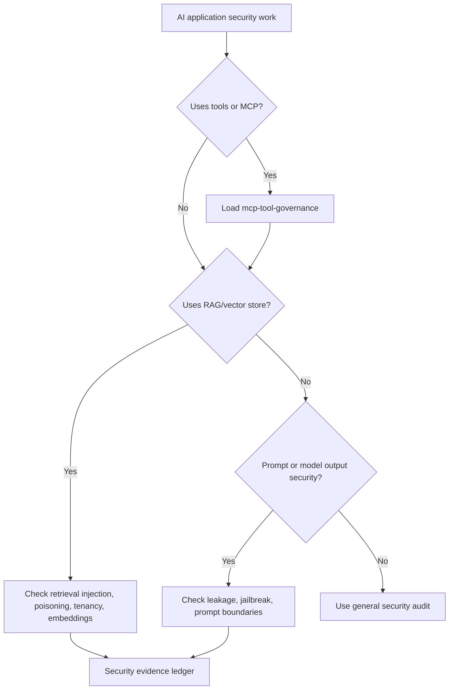

# AI Application Security

Use this skill for AI-specific security risks. Route through `skills/cybersecurity-risk-routing/SKILL.md` first when scope or authorization is uncertain.

<HARD-GATE>
Do not test prompt injection, system prompt extraction, RAG poisoning, vector leakage, or model/tool exfiltration against live systems unless the target is owned or explicitly authorized. Never treat a system prompt as a secret or an authorization boundary.
</HARD-GATE>

## Required Files

- `40_knowledge/SECURITY_FRAMEWORK_MAPPING.md`
- `60_templates/SECURITY_EVIDENCE_LEDGER_TEMPLATE.md` for Standard and above
- `60_templates/SECURITY_AUTHORIZATION_AND_SCOPE_TEMPLATE.md` when testing live endpoints or user/third-party data

## APIVR Routing

- Phase 1 Audit: map model, prompts, tools, data sources, vector stores, tenants, retrieval filters, output channels, and secrets.
- Phase 2 Plan: define allowed tests, safe corpus, non-production targets, leak criteria, evidence, and rollback/containment.
- Phase 3 Implement: test or build controls with least privilege, safe fixtures, and redacted logs.
- Phase 4 Audit Implementation: check prompt/data boundaries, tool boundaries, tenant isolation, and logging.
- Phase 5 Verify Implementation: run safe regression probes or document `Not Run` / `Blocked`.
- Phase 6 Re-Audit: update residual risk, guardrail gaps, and release verdict.

## AI Security Checklist

| Area | Check |
|---|---|
| Prompt boundary | No secrets, credentials, auth logic, or hidden business rules live only in prompts. |
| Prompt injection | Direct and indirect instruction override is tested or explicitly marked `Not Run`. |
| RAG | Retrieved content is treated as untrusted input and separated from system/developer authority. |
| Vector stores | Tenant isolation, metadata filters, write paths, and retrieval poisoning risks are reviewed. |
| Tools | Tool calls use allowlists, schemas, least privilege, and approval gates for high-impact actions. |
| Data leakage | Logs, traces, model outputs, and retrieved chunks avoid secrets and private data exposure. |
| Evaluation | Regression probes exist for material prompt, retrieval, or tool-routing changes. |

## Decision Flow

## Good / Bad

<Bad>
Put API keys, admin routing rules, or customer permissions in the system prompt and rely on the model not revealing them.
</Bad>

<Good>
Keep secrets and authorization server-side, treat prompts as steerable text, test leakage attempts, and enforce tool permissions outside the model.
</Good>

## Worked Example

Scenario: Internal document chatbot uses RAG over HR and finance docs.

1. Select Comprehensive because private employee and finance data are in scope.
2. Verify corpus ingestion paths and tenant/role filters.
3. Test with safe fixture documents containing benign injected instructions.
4. Confirm retrieved instructions cannot override system authority or call privileged tools.
5. Record retrieved chunks, responses, filters, and mitigation evidence.
6. Final verdict is blocked if cross-role retrieval is `Unknown` or `Verified` failing.

## Final Output

Report system boundary, AI-specific risks, tests run, evidence state, failed or blocked checks, mitigations, release-gate status, and APIVR verdict.
