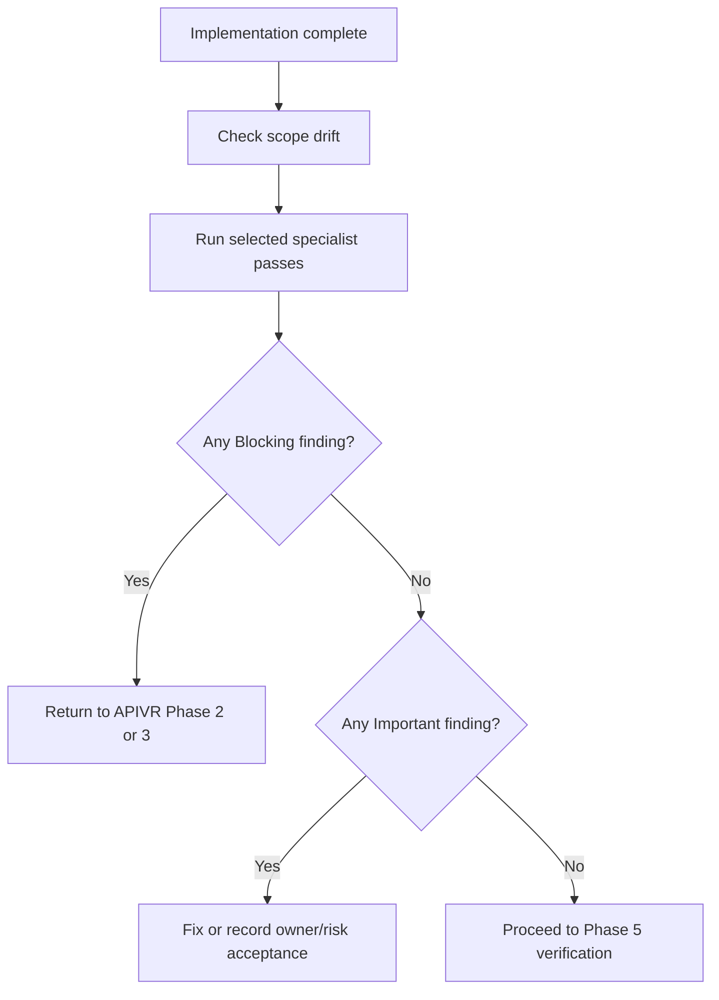

# Code Review And Review Army

Use this skill during APIVR Phase 4 after implementation and before final verification claims.

## Specialist Passes

Select only relevant reviewers:

- Spec Compliance Reviewer: checks scope, acceptance criteria, and preserved behavior.
- Security Reviewer: auth, permissions, secrets, input/output, abuse, and data exposure.
- API Contract Reviewer: request/response compatibility, versioning, webhooks, retries, and idempotency.
- Data/Migration Reviewer: writes, backfills, transactions, reversibility, and reconciliation.
- Testing Reviewer: Red-Green-Refactor evidence, weak assertions, skipped tests, and false confidence.
- Performance/Cost Reviewer: hot paths, query shape, caching, payload size, and unbounded work.
- Maintainability Reviewer: module boundaries, naming, deletion test, and local patterns.
- UX/QA Reviewer: user flow, accessibility, responsive behavior, and adverse states.

## Review Flow



## Finding Format

```text
Reviewer:
Finding:
Severity: Blocking / Important / Advisory
Evidence:
Affected file or behavior:
Required action:
Release gate impact:
```

## Worked Example

Scenario: A webhook implementation passes tests.

- API Contract Reviewer finds missing signature timestamp tolerance.
- Security Reviewer marks replay protection `Unknown`.
- Testing Reviewer asks for invalid-signature and replay tests.
- APIVR verdict: `CONDITIONAL PASS` only after those tests pass or the release owner explicitly accepts non-critical risk. For payment webhooks, this is normally Blocking.

