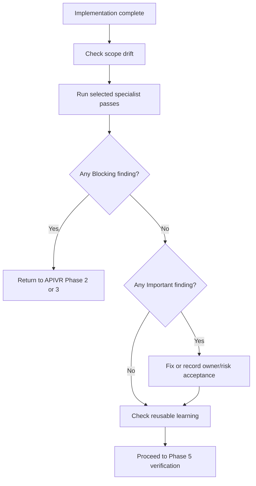

# Code Review And Review Army

Use this skill during APIVR Phase 4 after implementation and before final verification claims.

## Specialist Passes

Select only relevant reviewers:

- Spec Compliance Reviewer: checks scope, acceptance criteria, and preserved behavior.
- Security Reviewer: auth, permissions, secrets, input/output, abuse, and data exposure.
- API Contract Reviewer: request/response compatibility, versioning, webhooks, retries, and idempotency.
- Data/Migration Reviewer: writes, backfills, transactions, reversibility, and reconciliation.
- Testing Reviewer: Red-Green-Refactor evidence, weak assertions, skipped tests, and false confidence.
- Performance/Cost Reviewer: hot paths, query shape, caching, payload size, and unbounded work.
- Maintainability Reviewer: module boundaries, naming, deletion test, and local patterns.
- UX/QA Reviewer: user flow, accessibility, responsive behavior, and adverse states.
- External Integration Gatekeeper: provider-facing route contracts, deployed provider delivery, deployment protection, middleware redirects, sandbox/live split, and machine-caller auth boundaries.
- 20 Pass Reviewer: high-stakes source files, prompts, agents, skills, plans, runbooks, release instructions, and final reports have gone through the 20 Pass Protocol or have a justified compressed pass.
- Learning Reviewer: checks whether findings reveal a reusable lesson, stale guidance, or duplicate source of truth that should route to compound learning or knowledge refresh after verification.

## Review Flow



## Finding Format

```text
Reviewer:
Finding:
Severity: Blocking / Important / Advisory
Evidence:
Affected file or behavior:
Required action:
Release gate impact:
Reusable learning impact:
```

## Finding Lifecycle

- Blocking findings return to APIVR Phase 2 or Phase 3 before release.
- Important findings must be fixed, explicitly accepted as non-critical risk, or assigned with an owner before release.
- Advisory findings may be deferred, but repeated advisory patterns should trigger `skills/compound-learning-capture/SKILL.md`.
- Findings that expose stale or duplicated kit guidance trigger `skills/knowledge-refresh-and-drift-control/SKILL.md`.
- Do not capture a learning entry from a finding until the fix or accepted decision has evidence.

## Worked Example

Scenario: A webhook implementation passes tests.

- API Contract Reviewer finds missing signature timestamp tolerance.
- Security Reviewer marks replay protection `Unknown`.
- Testing Reviewer asks for invalid-signature and replay tests.
- External Integration Gatekeeper blocks release if the provider dashboard has not delivered an event into the deployed URL or if the route redirects to login.
- Learning Reviewer routes the final verified replay lesson to canonical external API guidance instead of creating a duplicate note.
- APIVR verdict: `CONDITIONAL PASS` only after those tests pass or the release owner explicitly accepts non-critical risk. For payment webhooks, this is normally Blocking.
