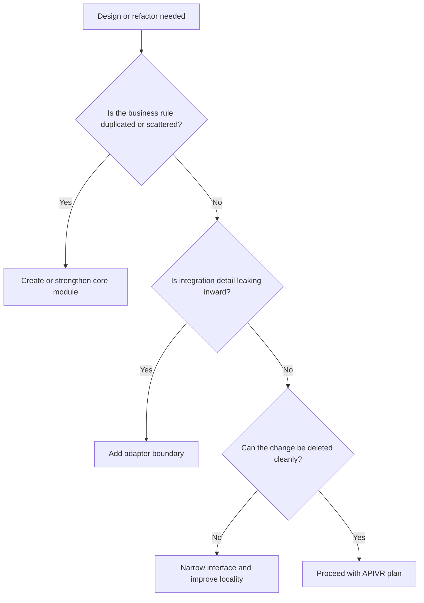

# Codebase Design And Deep Modules

Use this skill when the shape of the code matters as much as the code itself.

## Design Checks

- Module depth: a simple interface hides meaningful complexity.
- Locality: related decisions live near each other.
- Dependency direction: core policy does not depend on delivery details.
- Adapter boundary: third-party, UI, persistence, and transport concerns stay replaceable.
- Deletion test: removing the feature or provider has a predictable blast radius.
- Naming: code uses the project domain glossary.
- Escape hatches: special cases are explicit, not scattered.

## Decision Flow

## Worked Example

Scenario: Three providers calculate shipping estimates differently.

- Bad design: provider-specific logic in checkout UI.
- Better design: `ShippingQuoteService` exposes one domain method and provider adapters implement external details.
- Evidence: contract tests cover provider-independent behavior.
- Release gate: architecture passes only when checkout no longer knows provider-specific quirks.

