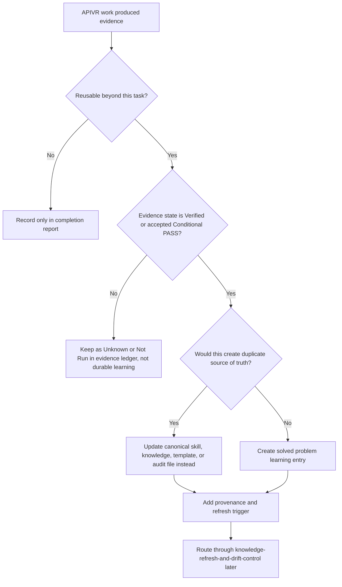

# Compound Learning Capture

Use this skill after evidence exists. It turns a solved problem into a small reusable learning artifact that future agents can find, verify, and refresh.

<HARD-GATE>
Do not capture guesses, preferences, or unverified lessons as durable knowledge. A compound learning entry must point to evidence, name its scope, and remain subordinate to APIVR, the Elite Build Goals, and canonical kit files.
</HARD-GATE>

## When To Use

Use for Standard and above work when one or more are true:

- A bug, incident, security issue, release problem, or integration failure was solved.
- A plan or review found a reusable decision pattern.
- A repeated workflow produced a better stop condition, evidence rule, or routing rule.
- A provider, API, hosting, automation, UI, reporting, security, or build system behavior was learned.
- A completion report contains a lesson that would prevent future rework.

Do not use for one-off trivia, unverified hunches, project secrets, credentials, private customer data, or content that belongs only in an issue tracker.

## APIVR Placement

Compound learning is normally an APIVR Phase 6 Re-Audit output.

1. Audit: identify the observed problem or decision.
2. Plan: decide whether the lesson is reusable and where it belongs.
3. Implement: create or update the learning artifact.
4. Audit Implementation: check for duplication, overgeneralization, and stale-source risk.
5. Verify Implementation: confirm links, evidence, scope, and routing.
6. Re-Audit: decide whether to keep, consolidate, or schedule refresh.

## Decision Flow

## Required Fields

Use `60_templates/SOLVED_PROBLEM_LEARNING_TEMPLATE.md`.

- Problem pattern.
- Context where it applies.
- Evidence that proved the lesson.
- Decision or action that worked.
- What failed or was rejected.
- Canonical files affected or referenced.
- Future trigger for using the lesson.
- Refresh trigger and owner.
- Redaction status.
- APIVR verdict.

## Good / Bad

<Bad>
Provider webhooks are flaky. Add retries next time.
</Bad>

<Good>
When provider webhooks can be delivered more than once, require an idempotency key test before release. Evidence: duplicate-delivery test passed, sandbox replay produced one payment record, and logs showed no secret exposure. Applies to payment webhooks and other write-producing callbacks. Canonical routing: `skills/external-api-integration/SKILL.md`, `skills/test-driven-development/SKILL.md`, and `10_governance/RELEASE_GATES.md`.
</Good>

## Worked Example

Scenario: A release was delayed because a scheduled export generated correct rows but wrong totals after a timezone boundary.

- APIVR tier: Comprehensive because reporting affected business decisions.
- Evidence: failing timezone fixture, corrected export total, reconciliation with source data, and QA health report.
- Learning captured: scheduled reports must include timezone-boundary fixtures and reconciliation totals before release.
- Canonical updates: add a check to `skills/data-output-and-reporting/SKILL.md` if this is broadly useful; otherwise create a solved-problem learning entry.
- Verdict: `PASS` only if evidence is Verified and no private data appears in the learning artifact.

## Completion Standard

A compound learning entry is complete when it is evidence-backed, scoped, redacted, linked to canonical routing, and has a future refresh trigger. If it weakens or duplicates an existing canonical file, update the canonical file instead.
