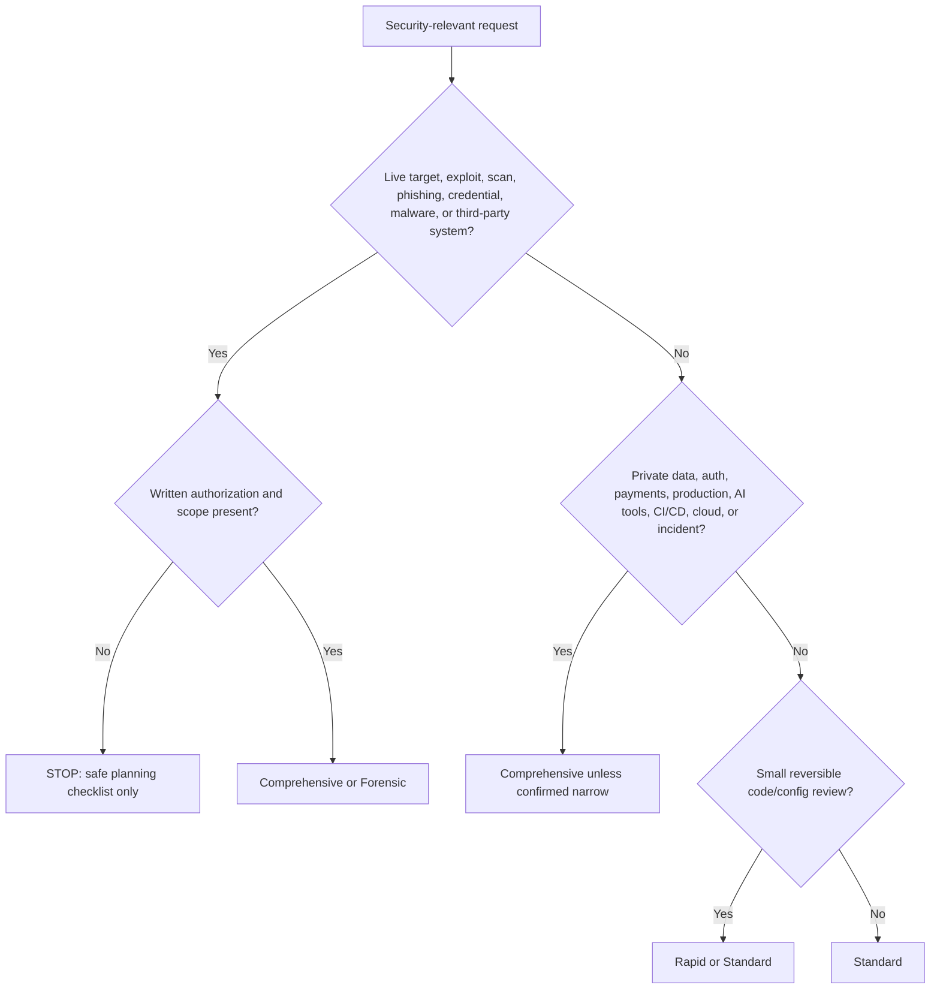

# Cybersecurity Risk Routing

Use this skill as the first cybersecurity decision point. It does not replace APIVR; it selects the right security depth and the right specialist skill.

<HARD-GATE>
Security work that tests, scans, exploits, phishes, collects credentials, executes malware, probes cloud tenants, or targets systems outside the workspace requires explicit authorization, written scope, targets, rules of engagement, and a containment plan. If authorization is missing, stop and provide a safe planning checklist only.
</HARD-GATE>

## Required Files

Load when cybersecurity routing is in scope:

- `40_knowledge/CYBERSECURITY_RISK_ROUTING_INDEX.md`
- `40_knowledge/SECURITY_FRAMEWORK_MAPPING.md`
- `60_templates/SECURITY_AUTHORIZATION_AND_SCOPE_TEMPLATE.md` when dual-use or live-system testing may occur
- `60_templates/SECURITY_EVIDENCE_LEDGER_TEMPLATE.md` for Standard and above security work

## APIVR Security Routing

- Phase 1 Audit: identify asset, owner, data sensitivity, attack surface, authorization status, live-system impact, and applicable frameworks.
- Phase 2 Plan: choose tier, security modules, evidence, stop conditions, rollback/containment, and authorization boundaries.
- Phase 3 Implement: perform only approved defensive checks or scoped tests; do not exceed authorization.
- Phase 4 Audit Implementation: check scope drift, evidence quality, safety controls, and whether findings are reproducible.
- Phase 5 Verify Implementation: verify remediation, mitigations, detection, or release gates with documented evidence.
- Phase 6 Re-Audit: classify residual risk, owners, time-bound exceptions, and next security action.

## Tier Router

## Specialist Routing

| Trigger | Load |
|---|---|
| RAG, LLM app, prompt injection, vector DB, model/tool leakage | `skills/ai-application-security/SKILL.md` |
| Security alert, suspected breach, compromise, exfiltration, ransomware | `skills/security-incident-response/SKILL.md` |
| CI/CD, SBOM, dependencies, signed artifacts, provenance, container/IaC scans | `skills/supply-chain-and-build-provenance/SKILL.md` |
| MCP servers, plugin tools, connectors, tool poisoning, tool auth | `skills/mcp-tool-governance/SKILL.md` |
| REST/GraphQL/gRPC APIs, OAuth, webhooks, BOLA, rate limits | `skills/external-api-integration/SKILL.md` |
| Vulnerability prioritization | `40_knowledge/SECURITY_FRAMEWORK_MAPPING.md` and SSVC routing in this skill |

## Evidence Standard

Security claims must say one of:

- `Verified`: direct evidence supports the claim.
- `Likely`: strong evidence but not complete.
- `Suspected`: plausible and needs proof.
- `Unknown`: not enough evidence.
- `Not Run`: check was not performed.
- `Blocked`: check could not be performed and why.

Never convert `Unknown`, `Not Run`, or `Blocked` into `PASS` for core security release gates.

## Worked Example

Scenario: A user asks whether a new OAuth integration is safe to release.

1. Select Comprehensive because auth and private user data are in scope.
2. Load `skills/external-api-integration/SKILL.md`, `40_knowledge/SECURITY_FRAMEWORK_MAPPING.md`, and the security evidence ledger.
3. Check scopes, token storage, callback validation, webhook signatures, replay protection, logs, rate limits, and revocation.
4. Verify with sandbox OAuth flow and safe test user.
5. Release verdict is `PASS` only if Gate C and Gate H evidence are Verified.

## Final Output

Report APIVR tier, authorization status, scope, security modules loaded, frameworks used, evidence state, release-gate status, residual risk, and final verdict.
