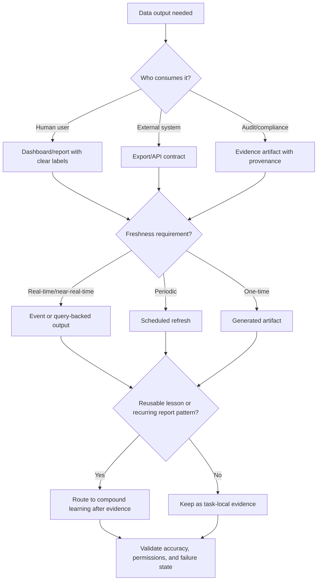

# Data Output And Reporting

Use this skill to choose the safest and most useful reporting/output format.

## Required Inputs

- Audience, decision the report supports, and required freshness.
- Source data, transformations, filters, permissions, and retention.
- Output channel: dashboard, export, email, file artifact, API endpoint, or audit/compliance record.
- Accuracy threshold and verification horizon.

## Routing Workflow

1. Read `40_knowledge/AUTOMATION_AND_REPORTING_PATTERNS.md`.
2. Classify the output:
   - live dashboard;
   - scheduled report;
   - downloadable export;
   - API endpoint;
   - notification summary;
   - audit/compliance evidence;
   - ad hoc artifact.
3. Define data contract, freshness, permissions, privacy controls, and reconciliation checks.
4. Decide whether scheduling/automation or external API guidance also applies.
5. Decide whether the output is task-local, audit evidence, release evidence, or reusable learning.
6. Verify data accuracy, completeness, permissions, and business usefulness.

## Decision Graph

## Guardrails

- Do not expose private or sensitive data without permission checks.
- Do not report derived metrics without source definition and reconciliation.
- Do not claim business outcome success from a generated report alone.
- Do not create a second source of truth without migration and ownership.
- Do not turn every report into durable learning; capture only reusable, evidence-backed lessons.
- Do not include private data, secrets, raw customer records, or sensitive operational details in solved-problem learning.

## Worked Example

Scenario: Add a monthly revenue export.

- Route: scheduled export with immutable evidence artifact.
- Connected skills: scheduling for refresh, external API if billing provider data is pulled, TDD for transformation logic.
- Evidence: sample export, reconciliation total, permission check, failed-run behavior, and retention location.
- Compound learning: capture a lesson only if the export reveals a reusable reporting rule, such as timezone-boundary reconciliation or permission checks for generated files.
- APIVR verdict: `PASS` only when accuracy, access control, freshness, and recovery are Verified.

## Closeout

Report output format, source of truth, data checks, permission checks, evidence state, reusable-learning decision, and APIVR verdict.
