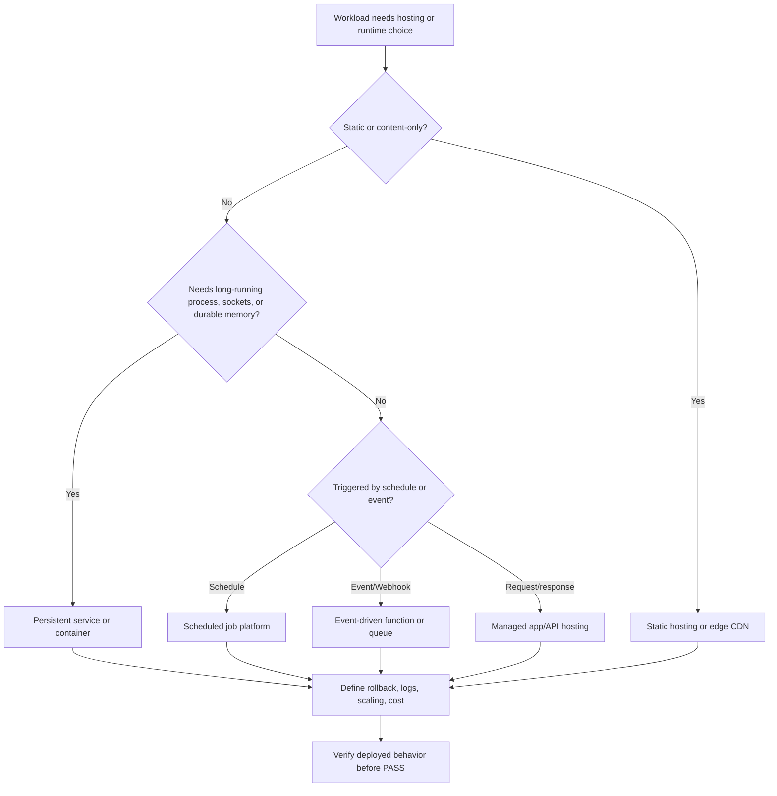

# Deployment And Hosting Guidance

Use this skill to route deployment and hosting decisions through APIVR.

## Required Inputs

- APIVR tier and applicable Elite Build Goals.
- Application type, runtime, data/storage needs, traffic expectations, and deployment target if known.
- Current hosting provider, environment layout, build/deploy commands, and rollback path.
- Cost sensitivity and reliability target.

## Routing Workflow

1. Read `40_knowledge/DEPLOYMENT_AND_HOSTING_GUIDANCE.md`.
2. Classify workload shape:
   - static/edge;
   - server-rendered web app;
   - API/service;
   - background worker;
   - scheduled job;
   - event-driven function;
   - database/storage dependent app;
   - always-on realtime process.
3. Decide whether the workload needs persistent compute, ephemeral execution, managed platform hosting, container hosting, or dedicated infrastructure.
4. Identify environment requirements: local, preview, staging, production, rollback, secrets, logs, monitoring, and domain/DNS.
5. Record deployment evidence in the evidence ledger and completion report.

## Decision Graph

## Guardrails

- Do not deploy without rollback or restoration planning for Standard and above.
- Do not choose always-on infrastructure for work that can safely be event-driven or scheduled.
- Do not choose ephemeral/serverless hosting for workloads that require durable in-memory state, long-running sockets, or local filesystem persistence.
- Do not claim deployment success until the deployed URL or service behavior is verified.
- Treat production deployment, DNS, database migration, payment/auth changes, and destructive infrastructure changes as Comprehensive or Forensic when consequences warrant.

## Worked Example

Scenario: A reporting dashboard also needs a nightly refresh.

- Hosting route: dashboard on managed web hosting; nightly refresh as scheduled job, not always-on compute.
- APIVR tier: Standard unless private data, revenue reporting, or production migration raises it.
- Connected skills: `scheduling-and-automation-routing`, `data-output-and-reporting`, and `test-driven-development` for code changes.
- Evidence: preview URL verified, scheduled job dry-run verified, logs visible, rollback path documented.
- APIVR verdict: `PASS` only after deployed dashboard and refresh behavior are Verified.

## Closeout

Report hosting decision, tradeoffs, cost risk, rollback method, verification performed, remaining risk, and APIVR verdict.
