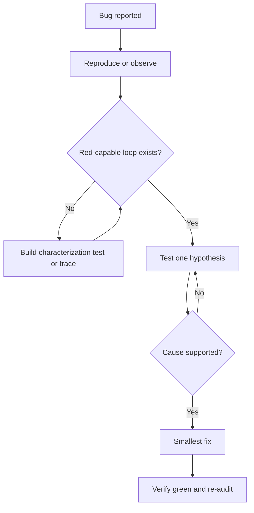

# Diagnosing Bugs And Feedback Loops

Use this skill before changing code for a bug.

<EXTREMELY-IMPORTANT>
No fix before a red-capable feedback loop. Reproduce, observe, or create a failing characterization path before theorizing too far.
</EXTREMELY-IMPORTANT>

## Protocol

1. State the symptom, expected behavior, and observed behavior.
2. Create the tightest feedback loop that can go red and green.
3. Lock scope: do not fix adjacent issues unless APIVR escalates scope.
4. Form one hypothesis at a time.
5. Test the hypothesis with logs, tests, traces, or controlled reproduction.
6. Implement the smallest fix after the cause is supported.
7. Verify targeted behavior and scan nearby regression risk.

## Debug Flow

## Worked Example

Scenario: Exports sometimes contain duplicate rows.

- Feedback loop: fixture with two overlapping sync windows reproduces duplicate export rows.
- Hypothesis: sync cursor is inclusive on both windows.
- Fix: make the second window start exclusive of last exported id.
- Evidence: targeted export test and adjacent backfill test pass.

