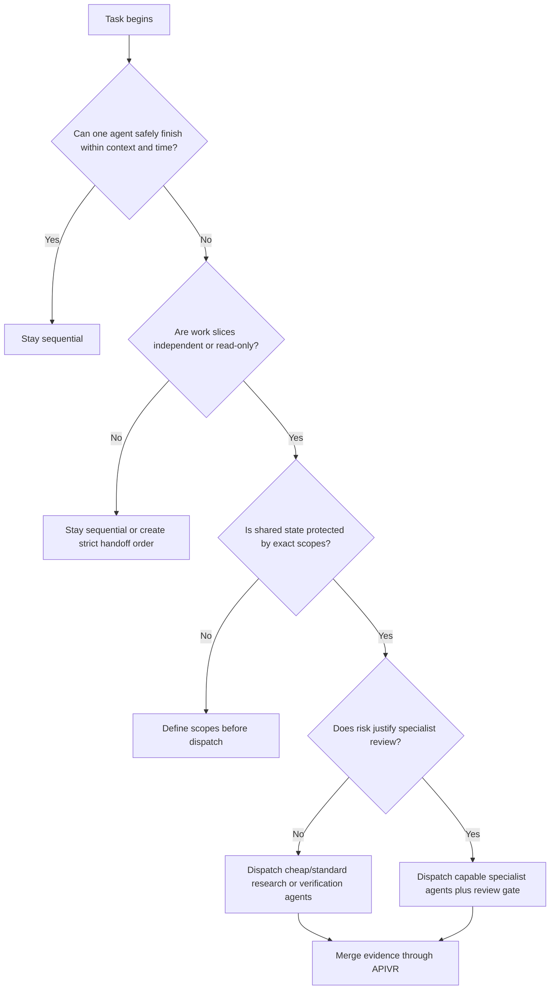

# Dispatching Parallel Agents

Use this skill before launching subagents or parallel workstreams.

<HARD-GATE>
Parallel dispatch must reduce risk, time, or context load without fragmenting source-of-truth control. APIVR remains centralized with one evidence ledger and one final verdict.
</HARD-GATE>

## Dispatch Decision Graph



## When To Dispatch

Dispatch when at least one condition is true:

- Multiple independent files, modules, providers, or workflows must be audited.
- One agent needs implementation while another performs independent review.
- A forensic or comprehensive audit needs specialist perspectives.
- Context would become overloaded if all evidence stayed in one agent.
- Time matters and work can be safely split without write conflicts.

Stay sequential when:

- The task is small and local.
- Correctness depends on one continuous reasoning chain.
- Work slices would modify the same files without a strict owner.
- Security, data, or release authority is unclear.

## Model Tiers

| Tier | Use for | Avoid for |
|---|---|---|
| Cheap | File inventory, link checks, simple search, formatting review, duplicate detection. | Architecture, security, data loss, payment, auth, final verdicts. |
| Standard | Focused implementation, unit tests, local refactors, component review, docs wiring. | Forensic judgment, ambiguous design, high-risk release calls. |
| Capable | Architecture, security, data integrity, production incidents, final review, synthesis. | Bulk mechanical scans that cheaper agents can do. |

## Dispatch Prompt Fields

Every dispatched prompt must include:

```text
Role:
APIVR tier:
Objective:
Exact scope:
Files/systems allowed:
Files/systems forbidden:
Source-of-truth files:
Applicable Elite Build Goals:
Required skill(s):
Evidence required:
Stop conditions:
Output format:
Status allowed: DONE / DONE_WITH_CONCERNS / NEEDS_CONTEXT / BLOCKED
```

## Worked Example

Scenario: Add API rate-limit handling and update a scheduled sync.

- Agent A audits current external API calls read-only.
- Agent B audits scheduler retry/idempotency read-only.
- Agent C writes a TDD plan after A and B report.
- Implementer owns exact files only after the plan is accepted.
- Reviewer checks spec compliance, then code quality.
- Orchestrator merges evidence and issues APIVR verdict.

Final verdict remains centralized. A subagent may recommend `PASS`, but cannot declare release success.
