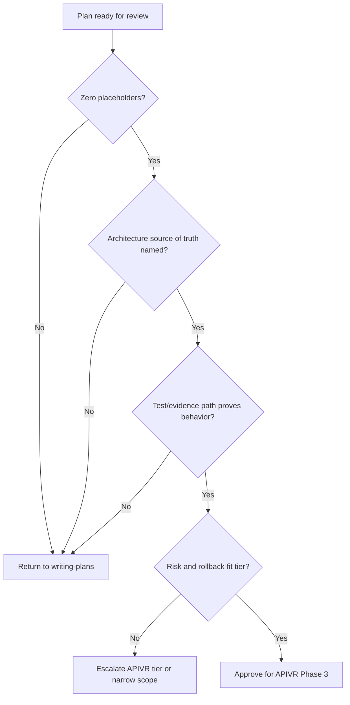

# Engineering Plan Review

Use this skill after `skills/writing-plans/SKILL.md` drafts a plan and before APIVR Phase 3 implementation begins.

<HARD-GATE>
Do not approve a plan that cannot be executed and verified without inventing missing technical decisions.
</HARD-GATE>

## Review Order

1. Scope: objective, non-goals, acceptance criteria, and preserved behavior.
2. Architecture: source of truth, module boundaries, dependency direction, and data flow.
3. Testability: failing tests, characterization tests, contract tests, or evidence-first substitutes.
4. Risk: security, data integrity, migration, performance, cost, release, and rollback.
5. Operations: logs, metrics, health, retries, backfill, and incident recovery.
6. External integration gate: for provider callbacks, webhooks, OAuth/Auth redirects, cron routes, payments, email/SMS providers, or Preview/Production env splits, confirm `skills/external-integration-launch-gate/SKILL.md` was applied and route contracts exist.
7. Execution: exact files, commands, sequence, and stop conditions.

## Decision Flow



## Review Findings

Use this format:

```text
Finding:
Severity: Blocking / Important / Advisory
APIVR phase affected:
Evidence state:
Required correction:
```

## Worked Example

Scenario: A plan adds OAuth login.

- Blocking finding: plan names provider setup but omits callback validation and state/nonce checks.
- APIVR effect: security evidence remains `Unknown`; release gate C fails.
- Required correction: add auth threat model, tests for invalid state, provider error handling, secret storage, and rollback to password login.
- Verdict: return to Phase 2 until the evidence path is complete.

Scenario: A plan adds a Stripe webhook.

- Blocking finding: plan tests the route handler directly but omits deployed provider delivery through middleware and deployment protection.
- APIVR effect: release gates C, E, and H remain `Unknown`.
- Required correction: add external integration launch gate route contract, middleware/layout/deployment-protection checks, provider dashboard replay, database proof, and log evidence.
- Verdict: return to Phase 2 until the external-world evidence path is complete.
