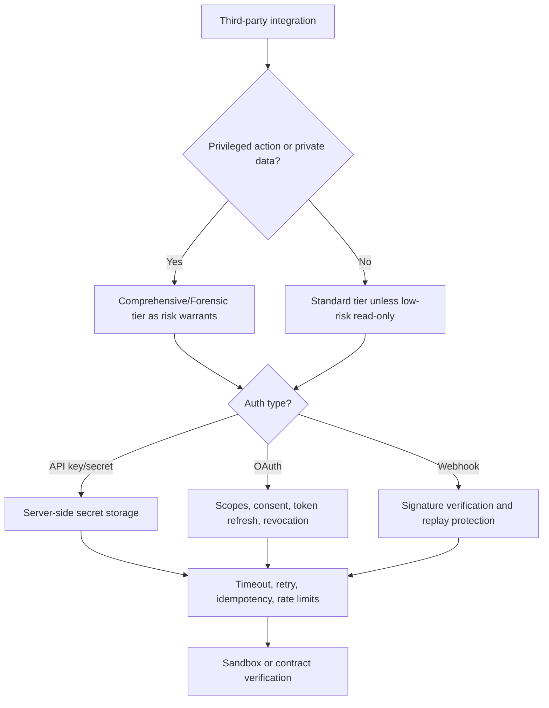

# External API Integration

Use this skill for third-party service integration under APIVR.

## Required Inputs

- Provider, endpoint/SDK, authentication method, data exchanged, and business purpose.
- Secret storage location and permission boundary.
- Rate limits, timeout/retry expectations, webhook behavior, and failure impact.
- Sandbox/test mode availability.

## Routing Workflow

1. Read `40_knowledge/EXTERNAL_API_INTEGRATION_GUIDANCE.md`.
2. Classify the integration:
   - read-only data retrieval;
   - write/action API;
   - webhook receiver;
   - OAuth/user-authorized integration;
   - payment/revenue/security/data-critical integration;
   - batch sync or scheduled polling.
3. If an outside system calls the app, load `skills/external-integration-launch-gate/SKILL.md` before planning, implementation, audit, release, or done claims. This includes provider webhooks, OAuth/Auth callbacks, cron/scheduler calls, SMS/provider queue callbacks, provider dashboard URLs, deployment protection, and sandbox/live environment separation.
4. If the work includes security testing, live probing, abuse testing, or third-party target assessment, load `skills/cybersecurity-risk-routing/SKILL.md` and require authorization/scope.
5. Define auth, secret handling, validation, logging, retry, timeout, idempotency, rate-limit, and fallback behavior.
6. Apply OWASP API checks when API security matters: BOLA/IDOR, broken auth, BFLA, mass assignment, SSRF, unsafe consumption, inventory, abuse controls, and rate limits.
7. Verify in sandbox or with safe test data when available.
8. Record external dependency risk, provider limits, and recovery path.

## Decision Graph

## Guardrails

- Do not hardcode secrets or expose them in logs, screenshots, commits, prompts, or reports.
- Do not trust client-side API calls for privileged operations.
- Do not implement unbounded retries or polling.
- Do not accept webhooks without signature verification when provider supports it.
- Do not declare inbound provider work complete from direct handler tests alone; verify the deployed provider-to-app path or apply `external-integration-launch-gate`.
- Do not let machine callers depend on human login. Webhooks, cron, and provider callbacks must use provider signatures, shared secrets, or platform auth instead.
- Treat payments, auth, private data, destructive actions, and revenue-critical integrations as Comprehensive or Forensic when warranted.
- Do not run live BOLA/IDOR, auth bypass, fuzzing, SSRF, or rate-limit tests against systems outside owned/authorized scope.
- Do not log full tokens, API keys, webhook secrets, session IDs, or sensitive provider payloads.

## Good / Bad

<Bad>
Put the provider API key in frontend code and retry every failed request until it succeeds.
</Bad>

<Good>
Store the provider secret server-side, call the provider through a backend boundary, set a timeout, retry only safe transient failures with a capped backoff, and record rate-limit behavior in the evidence ledger.
</Good>

## Worked Example

Scenario: Add a CRM contact sync.

- APIVR tier: Comprehensive if private customer data is written to a provider.
- Plan: failing test proves a duplicate provider response does not create duplicate local records.
- Implementation: server-side token use, scoped permissions, capped retries, idempotency key, safe logs.
- Verification: sandbox sync, duplicate test, rate-limit simulation or documented provider limit, rollback for disabling sync.
- Verdict: `PASS` only when auth, data integrity, rate limits, logging, and recovery evidence are Verified.

Scenario: Add a Stripe webhook.

- Pair with `external-integration-launch-gate`.
- Route contract: Stripe calls deployed `/api/.../webhook`; human login is not required; Stripe signature is required.
- Verification: provider dashboard sends or replays an event into the deployed URL; response is 200 for valid signed event and 400 for invalid signature; database and user-visible state update once.
- Verdict: `PASS` only when middleware, deployment protection, handler verification, database update, provider delivery log, and app log are Verified.

## Closeout

Report integration contract, secret handling, rate-limit strategy, failure behavior, verification evidence, and APIVR verdict.
