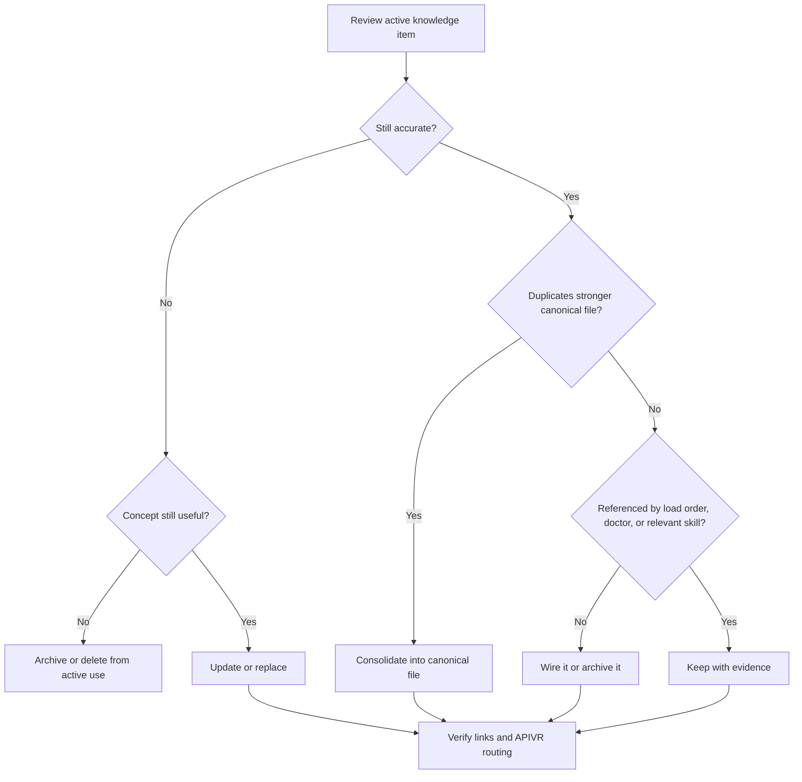

# Knowledge Refresh And Drift Control

Use this skill to keep the kit's knowledge clean. Its job is to prevent stale guidance, duplicate lessons, and outdated references from quietly becoming false authority.

<HARD-GATE>
Do not preserve a file merely because it exists. Every durable skill, knowledge doc, template, and solved-problem lesson must remain accurate, routed, useful, and subordinate to the source-of-truth order.
</HARD-GATE>

## Refresh Outcomes

Every reviewed item receives one outcome:

- `Keep`: still accurate, routed, and useful.
- `Update`: useful but stale, incomplete, or missing evidence.
- `Consolidate`: overlaps another file and should be merged into the stronger canonical file.
- `Replace`: concept remains useful but the current artifact is misleading or structurally wrong.
- `Archive`: no longer active, but provenance should remain.
- `Delete From Active Use`: unsafe, misleading, duplicate, or unsupported; preserve provenance when needed.

## APIVR Placement

Use during audits, release retrospectives, source integrations, and scheduled maintenance.

1. Audit: inventory active files and references.
2. Plan: choose Keep/Update/Consolidate/Replace/Archive/Delete outcomes.
3. Implement: edit canonical files narrowly.
4. Audit Implementation: check activation paths and duplicate truth.
5. Verify Implementation: run doctor, link checks, and sample workflow dry-runs.
6. Re-Audit: record the refresh report and remaining risks.

## Decision Flow

## Required Checks

- Authority: does the item conflict with APIVR or Elite Build Goals?
- Activation: can agents find it through `00_start_here/LOAD_ORDER.md` or a relevant skill?
- Duplication: does it create a second source of truth?
- Evidence: are claims backed by Verified, Likely, Suspected, Unknown, Not Run, or Blocked states?
- Freshness: are provider, platform, cost, security, or workflow details date-sensitive?
- Safety: does it contain secrets, private data, unsafe instructions, or unbounded automation?
- Portability: does it depend on one runtime without an adapter boundary?

## Required Output

Use `60_templates/KNOWLEDGE_REFRESH_REPORT_TEMPLATE.md` for Standard and above refresh work.

## Worked Example

Scenario: A new external API skill and an old reporting note both define retry rules.

- Audit finds duplicate guidance.
- Plan chooses `Consolidate`: retry rules belong in `skills/external-api-integration/SKILL.md`; reporting references that file when provider data is involved.
- Implementation removes duplicate retry detail from the reporting note and adds a clear link.
- Verification runs the doctor and checks load-order references.
- APIVR verdict: `PASS` when agents have one canonical route and no stale duplicate rule remains.

## Completion Standard

Refresh work is complete only when every reviewed item has an outcome, canonical files remain authoritative, references resolve, and the final report names unresolved Unknown, Not Run, or Blocked evidence.
