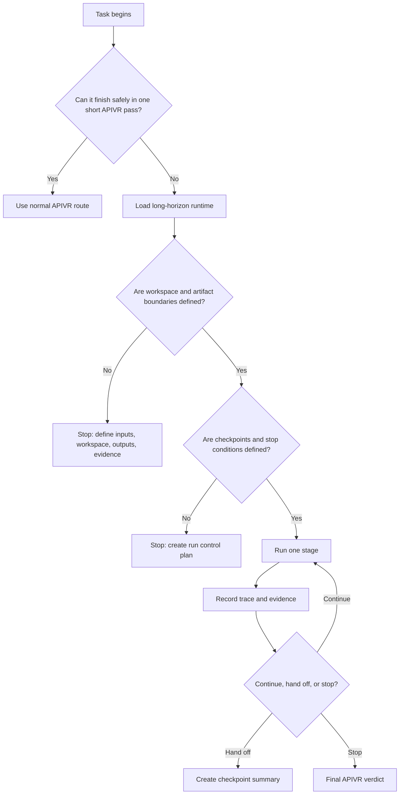

# Long-Horizon Agent Runtime

Use this skill when a task is too large, risky, or stateful for a single uninterrupted agent pass.

<HARD-GATE>
Long-horizon work must be checkpointed. Do not let a long-running agent accumulate hidden state, summarize away evidence, or continue without a current APIVR verdict.
</HARD-GATE>

## Required Files

Load when long-horizon execution is in scope:

- `40_knowledge/LONG_HORIZON_AGENT_RUNTIME_PATTERNS.md`
- `40_knowledge/AGENT_WORKSPACE_AND_ARTIFACT_BOUNDARIES.md`
- `60_templates/LONG_HORIZON_RUN_CONTROL_TEMPLATE.md`
- `60_templates/AGENT_RUN_TRACE_TEMPLATE.md`

## APIVR Routing

- Phase 1 Audit: classify tier, scope, runtime limits, tool access, workspace boundaries, artifact plan, subagent needs, and evidence horizon.
- Phase 2 Plan: define checkpoints, summaries, receipts, stop conditions, context-preservation rules, and handoff format.
- Phase 3 Implement: execute one bounded stage at a time; use subagents or loops only through their skills.
- Phase 4 Audit Implementation: check scope drift, artifact placement, evidence survival, tool use, and checkpoint quality.
- Phase 5 Verify Implementation: validate final outputs against trace, receipts, tests, logs, screenshots, or documented evidence.
- Phase 6 Re-Audit: compress only non-essential context; preserve decisions, evidence, changed files, risks, and next actions.

## Runtime Decision Flow

## Mandatory Controls

- Use `skills/repeatable-agent-loops/SKILL.md` for repeated stages.
- Use `skills/subagent-driven-development/SKILL.md` for delegated implementation or review.
- Use `skills/agent-observability-and-run-tracing/SKILL.md` for trace metadata and evidence survival.
- Use `skills/project-bootstrap-and-setup/SKILL.md` before installing, bootstrapping, or configuring a project.
- Use `skills/mcp-tool-governance/SKILL.md` before enabling MCP tools, tool servers, or external tool configs.
- Keep user inputs, scratch workspace, generated artifacts, and final outputs separated.
- Never summarize away evidence, changed files, risks, commands, verification, or unresolved decisions.

## Checkpoint Summary Standard

Every checkpoint must preserve:

- objective and APIVR tier;
- current stage and next stage;
- files, systems, data, and tools touched;
- decisions made and why;
- evidence collected and evidence state;
- verification run and not run;
- blockers, risks, and stop conditions;
- exact next action.

## Worked Example

Scenario: Comprehensive audit and repair of a deployment pipeline.

1. Select Comprehensive because deploy, environment, reliability, and rollback risks are involved.
2. Define workspace boundaries: source files, generated evidence, scratch logs, final report.
3. Create checkpoints: setup audit, failing reproduction, fix plan, implementation, verification, rollback proof.
4. Use loop receipts for repeated deploy checks and run trace records for each tool call category.
5. Stop if secrets are needed, production settings would change, or evidence becomes unavailable.
6. Final verdict includes run trace, artifacts, verification and remaining risks.

## Final Output

End with APIVR tier, run stage, checkpoint summary, trace status, evidence state, stop reason or next stage, release-gate status, and final verdict.
