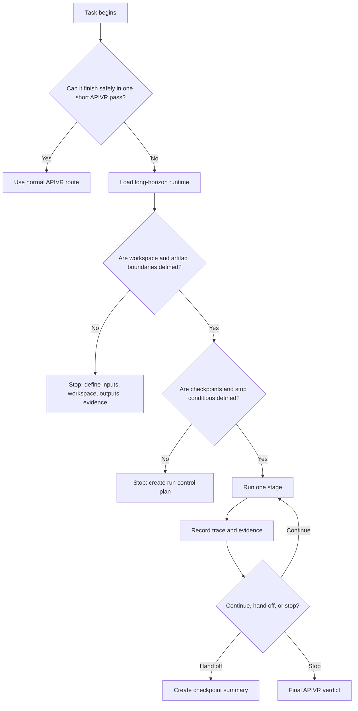

# Long-Horizon Agent Runtime

Use this skill when a task is too large, risky, or stateful for a single uninterrupted agent pass.

<HARD-GATE>
Long-horizon work must be checkpointed. Do not let a long-running agent accumulate hidden state, summarize away evidence, or continue without a current APIVR verdict.
</HARD-GATE>

## Required Files

Load when long-horizon execution is in scope:

- `40_knowledge/LONG_HORIZON_AGENT_RUNTIME_PATTERNS.md`
- `40_knowledge/AGENT_WORKSPACE_AND_ARTIFACT_BOUNDARIES.md`
- `60_templates/LONG_HORIZON_RUN_CONTROL_TEMPLATE.md`
- `60_templates/AGENT_RUN_TRACE_TEMPLATE.md`

## Memory Contract

**The Bootstrap Controller owns initialization integrity and rehydration eligibility; this skill owns only the runtime discipline required to make successful rehydration possible and mandatory on resume.**

<HARD-GATE>
On resuming any long-horizon run, verify the authoritative bootstrap certificate and rehydrate from the Controller-declared `rehydration_set` before continuing work. Never continue from partial project state.
</HARD-GATE>

The authoritative declaration is `rehydration_set` in `00_start_here/bootstrap-controller.json`. This skill must reference that declaration and must never copy or restate its file list.

### State Lifetimes

- **Session-scoped state:** temporary, discardable, and reconstructible. It may include scratch reasoning, transient tool output, and local execution context.
- **Project-scoped state:** durable state under `.wcbs/` that supports project recovery and rehydration. Its membership is defined only by the Bootstrap Controller.
- **Cross-project learning:** not a memory tier. Route reusable learning through `skills/compound-learning-capture/SKILL.md` and obey that skill's HARD-GATE.

### Resume Decision Rules

1. Verify the authoritative bootstrap certificate before using any existing project state.
2. Read the Controller's declared `rehydration_set` and rehydrate all declared project-scoped state.
3. If the certificate hash does not match current declared state, treat the project as changed under the agent and force complete re-initialization.
4. If project-scoped state exists but the authoritative certificate is missing, treat the prior run as interrupted before `CERTIFY` and force complete re-initialization.
5. Continue only after certificate validation and rehydration succeed. Otherwise return `BLOCKED` with the exact failure.

### Runtime Write Discipline

- Append a record to `evidence-ledger.jsonl` after every material checkpoint, verification result, state transition, blocker, recovery action, or handoff decision.
- Record the timestamp, canonical evidence state, claim, source, and phase required by the evidence-ledger schema.
- Append only. Do not overwrite, reorder, backfill invented evidence, or reconstruct a history that was not recorded when the event occurred.
- Preserve enough evidence for another agent to determine what changed, what was verified, what remains unresolved, and what exact action comes next.
- Write project-scoped state before issuing a checkpoint or handoff summary; a summary is not a substitute for durable state.

### Excuse / Reality

| Excuse | Reality |
|---|---|
| "I remember the context." | Memory is session-scoped and non-authoritative. Resume from the certificate and Controller-declared state. |
| "The summary is enough." | A summary can omit hashes, blockers, and evidence. Rehydrate the durable project state. |
| "Re-reading wastes tokens." | Continuing from stale state wastes the run and can corrupt evidence. The resume gate is mandatory. |
| "The state looks fine." | Appearance is not integrity. Verify the certificate and declared rehydration state. |

## APIVR Routing

- Phase 1 Audit: classify tier, scope, runtime limits, tool access, workspace boundaries, artifact plan, subagent needs, and evidence horizon.
- Phase 2 Plan: define checkpoints, summaries, receipts, stop conditions, context-preservation rules, and handoff format.
- Phase 3 Implement: execute one bounded stage at a time; use subagents or loops only through their skills.
- Phase 4 Audit Implementation: check scope drift, artifact placement, evidence survival, tool use, and checkpoint quality.
- Phase 5 Verify Implementation: validate final outputs against trace, receipts, tests, logs, screenshots, or documented evidence.
- Phase 6 Re-Audit: compress only non-essential context; preserve decisions, evidence, changed files, risks, and next actions.

## Runtime Decision Flow

```mermaid
flowchart TD
  A["Task begins"] --> B{"Can it finish safely in one short APIVR pass?"}
  B -- "Yes" --> C["Use normal APIVR route"]
  B -- "No" --> D["Load long-horizon runtime"]
  D --> E{"Are workspace and artifact boundaries defined?"}
  E -- "No" --> F["Stop: define inputs, workspace, outputs, evidence"]
  E -- "Yes" --> G{"Are checkpoints and stop conditions defined?"}
  G -- "No" --> H["Stop: create run control plan"]
  G -- "Yes" --> I["Run one stage"]
  I --> J["Record trace and evidence"]
  J --> K{"Continue, hand off, or stop?"}
  K -- "Continue" --> I
  K -- "Hand off" --> L["Create checkpoint summary"]
  K -- "Stop" --> M["Final APIVR verdict"]
```

## Mandatory Controls

- Use `skills/repeatable-agent-loops/SKILL.md` for repeated stages.
- Use `skills/subagent-driven-development/SKILL.md` for delegated implementation or review.
- Use `skills/agent-observability-and-run-tracing/SKILL.md` for trace metadata and evidence survival.
- Use `skills/project-bootstrap-and-setup/SKILL.md` before installing, bootstrapping, or configuring a project.
- Use `skills/mcp-tool-governance/SKILL.md` before enabling MCP tools, tool servers, or external tool configs.
- Keep user inputs, scratch workspace, generated artifacts, and final outputs separated.
- Never summarize away evidence, changed files, risks, commands, verification, or unresolved decisions.

## Checkpoint Summary Standard

Every checkpoint must preserve:

- objective and APIVR tier;
- current stage and next stage;
- files, systems, data, and tools touched;
- decisions made and why;
- evidence collected and evidence state;
- verification run and not run;
- blockers, risks, and stop conditions;
- exact next action.

## Worked Example

Scenario: Comprehensive audit and repair of a deployment pipeline.

1. Select Comprehensive because deploy, environment, reliability, and rollback risks are involved.
2. Define workspace boundaries: source files, generated evidence, scratch logs, final report.
3. Create checkpoints: setup audit, failing reproduction, fix plan, implementation, verification, rollback proof.
4. Use loop receipts for repeated deploy checks and run trace records for each tool call category.
5. Stop if secrets are needed, production settings would change, or evidence becomes unavailable.
6. Final verdict includes run trace, artifacts, verification and remaining risks.

## Final Output

End with APIVR tier, run stage, checkpoint summary, trace status, evidence state, stop reason or next stage, release-gate status, and final verdict.