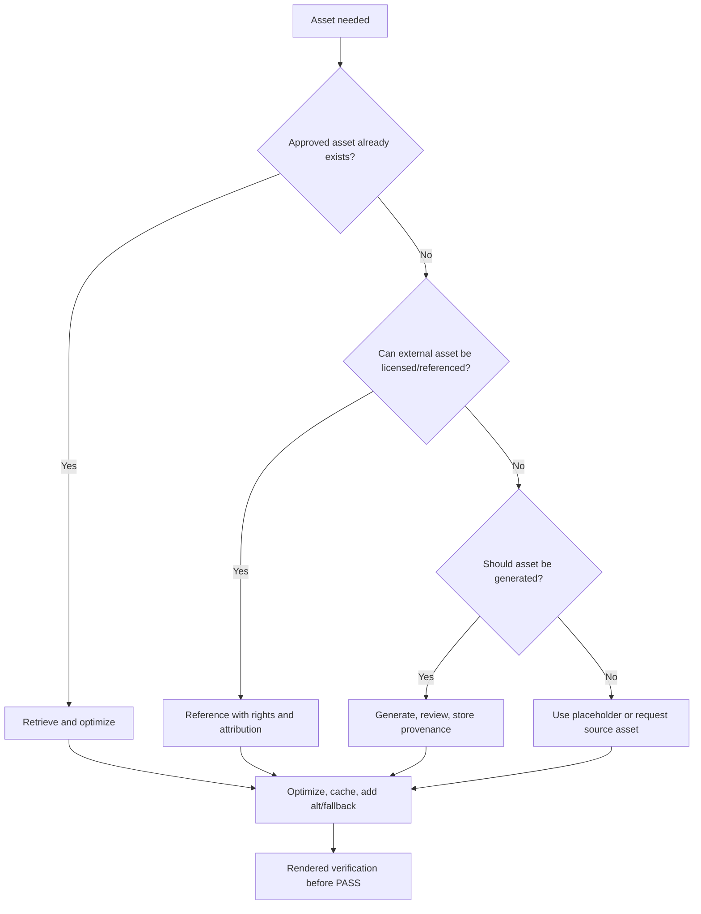

# Media And Asset Pipeline

Use this skill to route asset decisions safely and efficiently.

## Required Inputs

- Asset purpose, audience, brand/quality requirement, and usage context.
- Existing asset sources, licensing/rights status, format, size, and delivery constraints.
- Whether the asset is generated, retrieved, referenced, transformed, user-uploaded, or externally hosted.

## Routing Workflow

1. Read `40_knowledge/MEDIA_AND_ASSET_PIPELINE_GUIDANCE.md`.
2. Choose the asset route:
   - retrieve existing approved asset;
   - reference external asset;
   - generate new asset;
   - transform/compress/resize;
   - cache/CDN;
   - user upload and moderation;
   - fallback/placeholder.
3. Define rights, attribution, storage, optimization, responsive delivery, accessibility, and failure behavior.
4. Decide whether external API, deployment/hosting, or reporting guidance also applies.
5. Verify rendered output and delivery behavior when user-facing.

## Decision Graph

## Guardrails

- Do not use assets without rights, provenance, or user authorization.
- Do not rely on a single cinematic/decorative asset for essential content.
- Do not ship large media without responsive delivery or cost/performance awareness.
- Do not claim visual quality without rendered review.

## Good / Bad

<Bad>
Grab a random image URL, place it in production, and assume it will stay available.
</Bad>

<Good>
Use an approved asset or generated asset with provenance, store it in the project/CDN, optimize responsive variants, add alt text, and verify rendering in the target layout.
</Good>

## Worked Example

Scenario: Add product imagery to a landing page.

- Route: retrieve approved brand images when available; generate only missing concept art.
- Connected skills: deployment guidance for CDN/storage and external API guidance if generation uses a provider.
- Evidence: asset source, rights/provenance, file size, responsive variants, alt text, screenshot/rendered review.
- APIVR verdict: `PASS` only when rights, performance, accessibility, and rendered quality are Verified.

## Closeout

Report asset route, provenance/rights state, optimization, fallback behavior, rendered verification, and APIVR verdict.
