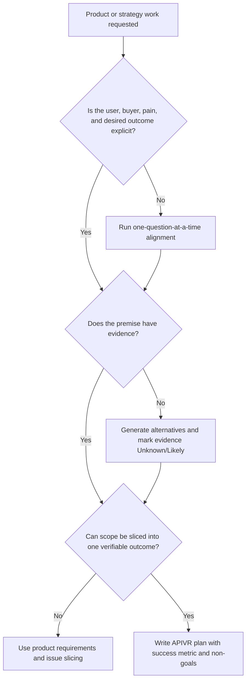

# Product Strategy Office Hours

Use this skill during APIVR Phase 1 Audit and Phase 2 Plan when the build decision itself needs pressure-testing.

<HARD-GATE>
Do not let product strategy become a brainstorm pile. Convert ambiguity into decisions, non-goals, evidence needs, and acceptance criteria before implementation.
</HARD-GATE>

## APIVR Integration

- Phase 1 Audit: identify user, buyer, pain, urgency, current workaround, promise, risk, and missing evidence.
- Phase 2 Plan: convert the decision into scope, non-goals, vertical slices, success metrics, and proof required.
- Phase 3 Implement: build only the approved slice.
- Phase 4-6: verify the user outcome, commercial claim, and evidence state.

## Decision Flow

## Operating Protocol

1. State the current premise in one sentence.
2. Ask or answer one decision-tree question at a time.
3. Identify the highest-risk assumption.
4. Generate at least two credible alternatives when the first idea is not clearly dominant.
5. Select the smallest vertical slice that can prove or disprove the premise.
6. Convert the result into acceptance criteria and evidence states.

## Good / Bad

<Bad>
Build the dashboard because the user asked for a dashboard.
</Bad>

<Good>
Clarify who uses the dashboard, which decision it changes, what data must be trusted, what export or alert replaces manual work, and which one metric proves the dashboard is useful.
</Good>

## Worked Example

Scenario: A founder asks for a lead-scoring dashboard.

- Premise: sales needs a faster way to decide which leads deserve same-day outreach.
- Highest-risk assumption: the existing CRM data actually predicts urgency.
- Alternative considered: daily prioritized email instead of a dashboard.
- APIVR decision: Standard tier because business workflow and reporting are affected.
- Plan output: one lead-priority view, one export, one evidence check against recent won/lost leads.
- Verdict rule: `PASS` only when the user decision, data source, and verification result are at least `Verified` or explicitly risk-accepted.

