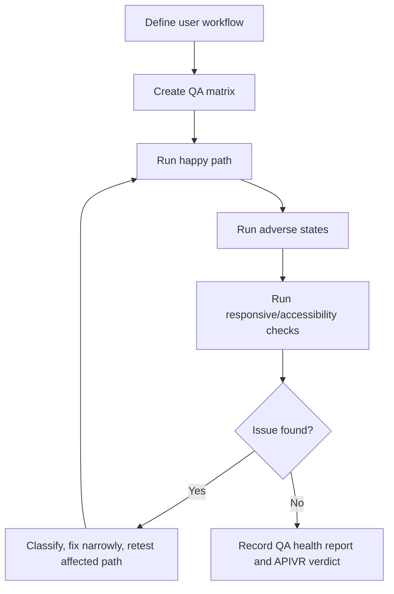

# QA And Browser Verification

Use this skill when success depends on a user-visible workflow, rendered interface, browser behavior, or manual acceptance path.

<HARD-GATE>
Browser QA alone cannot PASS workflows that depend on outside providers calling the app. For webhooks, OAuth/Auth callbacks, cron routes, payment/email/SMS providers, deployment protection, or Preview/Production environment splits, also use `skills/external-integration-launch-gate/SKILL.md`.
</HARD-GATE>

## QA Flow

## Required QA Matrix

- Happy path.
- Empty state.
- Loading state.
- Error state.
- Permission or auth boundary.
- External provider callback boundary when applicable.
- Responsive viewport checks.
- Accessibility checks.
- Data accuracy checks when reporting or analytics are visible.

## Issue Taxonomy

- Blocker: prevents core workflow or creates safety/security/data risk.
- Major: harms important workflow, trust, accessibility, or release readiness.
- Minor: visible polish issue with low functional risk.
- Observation: not a bug, but useful product or quality note.

## Worked Example

Scenario: A new admin report page.

- QA runs desktop and mobile viewports, empty dataset, provider timeout, export action, and keyboard navigation.
- Finding: mobile table overflows and export button is hidden.
- APIVR state: UI release gate is `Blocked` until fixed and retested.
- Final verdict: `PASS` only when screenshot evidence, export evidence, and adverse-state checks are recorded.

Scenario: A premium upgrade flow returns from Stripe.

- Browser QA verifies the user-visible checkout return and premium card state.
- External integration launch gate verifies Stripe webhook delivery into the deployed URL, no login redirect, correct signature handling, database update, provider event ID, and app log.
- Final verdict: `PASS` only when both the browser result and provider callback path are Verified.

