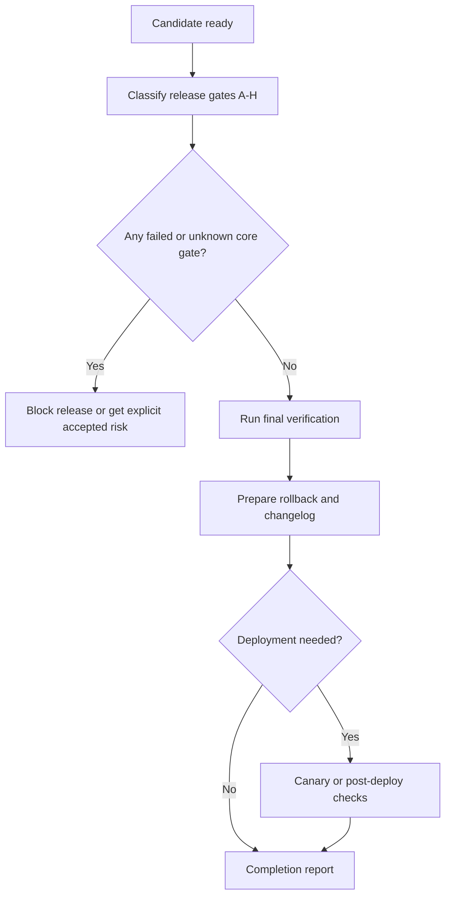

# Release Readiness And Ship Gates

Use during APIVR Phase 5 Verify Implementation and Phase 6 Re-Audit.

<HARD-GATE>
Do not say shipped, done, ready, or PASS while any applicable release gate is failed, unknown, not run, or blocked without named risk acceptance.
</HARD-GATE>

## Ship Flow

## Required Outputs

- Release gate table.
- Evidence ledger or security evidence ledger when applicable.
- Rollback trigger and restoration path.
- Changelog or user-facing note when behavior changes.
- Post-release verification horizon for production changes.

## Worked Example

Scenario: Shipping a subscription cancellation fix.

- Gate C: auth and permission tests verified.
- Gate D: duplicate cancellation and billing reconciliation verified.
- Gate E: rollback is feature-flag disable plus previous handler restore.
- Gate H: evidence ledger complete.
- Verdict: `PASS` after targeted tests and provider sandbox replay are Verified.

