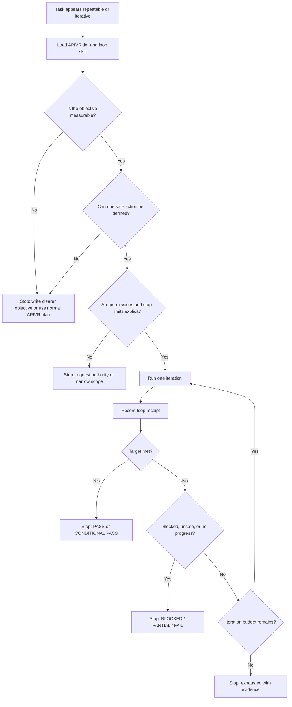

# Repeatable Agent Loops

Use this skill when work should repeat until a measurable condition is met, safely exhausted, or blocked.

<HARD-GATE>
A loop is not permission for open-ended autonomy. Every loop must have a bounded scope, a single-step action rule, evidence checks, stop conditions, and APIVR ownership.
</HARD-GATE>

## Required Files

Load these when designing or running a loop:

- `40_knowledge/REPEATABLE_AGENT_LOOP_PATTERNS.md`
- `60_templates/LOOP_DESIGN_TEMPLATE.md`
- `60_templates/LOOP_RUN_RECEIPT_TEMPLATE.md`

## APIVR Routing

- Phase 1 Audit: inspect current state, authority, target condition, risks, permissions, and evidence sources.
- Phase 2 Plan: define the loop design, iteration limit, stop conditions, rollback path, and receipt format.
- Phase 3 Implement: run one bounded action per iteration.
- Phase 4 Audit Implementation: check whether the action changed only the intended scope and whether evidence supports the result.
- Phase 5 Verify Implementation: record receipt evidence and decide continue, stop, escalate, or block.
- Phase 6 Re-Audit: review the full run for drift, missed risks, repeated failures, and future automation suitability.

## Loop Decision Flow

## Loop Contract

Every loop must define:

- Objective: the exact condition the loop is trying to reach.
- Scope: files, systems, users, data, environments, and actions allowed.
- Non-scope: forbidden files, systems, changes, or irreversible actions.
- One-step action: the largest action allowed in a single iteration.
- Evidence check: command, observation, test, log, screenshot, report, or human approval used to judge the step.
- Continue condition: what justifies another iteration.
- Stop conditions: success, clean no-op, blocked, unsafe, approval-required, exhausted, or no measurable progress.
- Iteration budget: maximum steps or timebox.
- Receipt: one `LOOP_RUN_RECEIPT_TEMPLATE.md` entry per iteration.

## Status Terms

Use only these loop outcomes:

| Status | Meaning |
|---|---|
| `SUCCESS` | Target condition is met with Verified evidence. |
| `CLEAN_NO_OP` | Nothing needed to change and evidence supports that. |
| `APPROVAL_REQUIRED` | Next step needs human approval, credential, irreversible action, or risk acceptance. |
| `BLOCKED` | Required context, access, dependency, or evidence is unavailable. |
| `EXHAUSTED` | Iteration budget ended before the target condition was met. |
| `NO_PROGRESS` | Repeated iterations are not moving the measured condition. |
| `UNSAFE_TO_CONTINUE` | Further action risks security, data, production, revenue, user trust, or source-of-truth integrity. |

## Good / Bad

<Good>
Run up to 5 iterations. Each iteration fixes one broken internal link, runs the link checker, records the changed file and command output, then stops when all links pass or a missing source cannot be resolved.
</Good>

<Bad>
Keep cleaning the docs until they look better.
</Bad>

## Worked Example

Scenario: recurring documentation link audit.

1. APIVR tier: Standard because the task changes documentation and verification routing.
2. Loop objective: all internal links in `00_start_here/`, `skills/`, and `60_templates/` resolve.
3. One-step action: fix or document one broken reference per iteration.
4. Evidence check: run the kit doctor and targeted path check after each step.
5. Stop: `SUCCESS` when checks pass; `BLOCKED` if a referenced file no longer exists and no canonical replacement is known.
6. Final verdict: `PASS` only if every changed link is Verified and the receipt records each step.

## Final Output

End with APIVR tier, loop status, iteration count, evidence summary, stop reason, release-gate status if applicable, and the single next required action.
