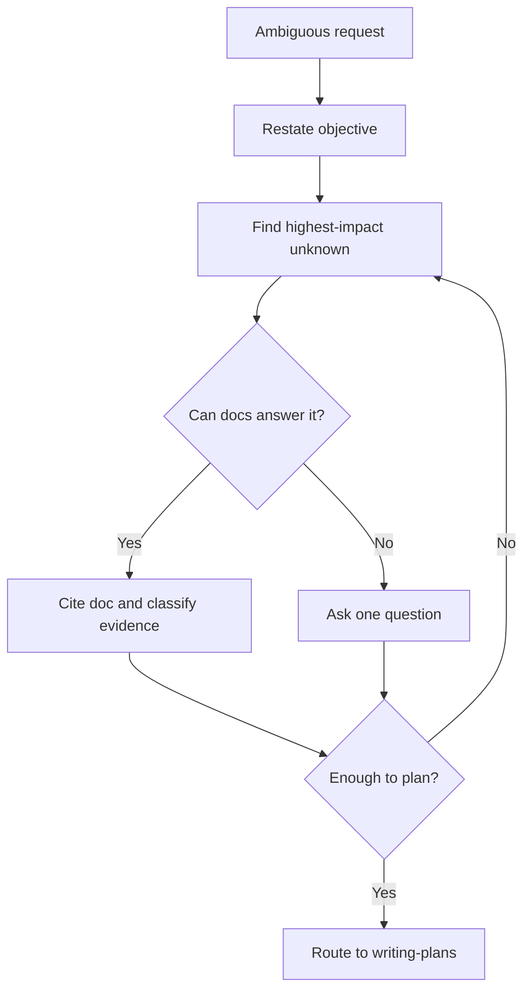

# Requirements Grilling And Alignment

Use this skill during APIVR Phase 1 when the request needs sharper requirements before a plan can be trusted.

<HARD-GATE>
Ask one decision-making question at a time. Do not ask a survey of questions unless the user explicitly requests a questionnaire.
</HARD-GATE>

## Protocol

1. Restate the request in one sentence.
2. Identify the single most consequential unknown.
3. Ask or resolve that unknown using available docs.
4. Repeat until scope, non-goals, acceptance criteria, and evidence are clear enough for APIVR tier.
5. Convert answers into a zero-placeholder plan or mark `BLOCKED`.

## Decision Flow

## Worked Example

Scenario: "Add notifications."

- Highest-impact unknown: what event should notify whom.
- One question: "Which single event should trigger the first notification, and who must receive it?"
- Result: password reset failure alerts go to admins.
- APIVR plan now has exact event, recipient, channel, evidence, and non-goals.

