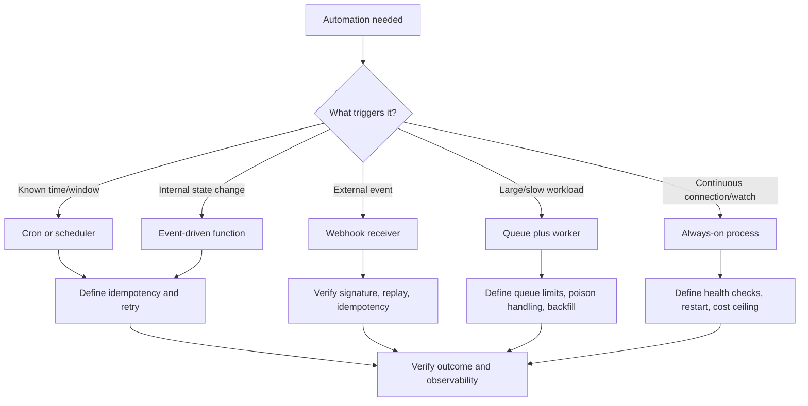

# Scheduling And Automation Routing

Use this skill to decide how automation should run and how it should be verified.

## Required Inputs

- Trigger source and timing requirement.
- Required freshness, latency, retry, idempotency, and failure behavior.
- Data writes, external API calls, cost limits, and user/business impact.
- Current hosting/runtime constraints.

## Routing Workflow

1. Read `40_knowledge/AUTOMATION_AND_REPORTING_PATTERNS.md`.
2. Select the automation shape:
   - cron/scheduled task;
   - webhook;
   - event-driven function;
   - queue/worker;
   - always-on process;
   - manual/admin-triggered job;
   - monitor/reminder/follow-up.
3. Define idempotency, retry, timeout, duplicate prevention, observability, and recovery behavior.
4. Decide whether the job requires deployment/hosting guidance or external API integration guidance.
5. If the trigger is a webhook, provider callback, cron route, or external scheduler hitting a deployed URL, load `skills/external-integration-launch-gate/SKILL.md` and require a route contract plus deployed-path verification.
6. Verify both technical execution and the intended operational/business outcome.

## Decision Graph

## Guardrails

- Do not create unbounded retries, unbounded queues, or unbounded polling.
- Do not use always-on workers when scheduled or event-driven execution satisfies the objective.
- Do not process external webhooks without verification, replay protection, and safe logging.
- Do not require human login for machine-triggered cron, webhook, queue, or provider routes. Use the appropriate signature, shared secret, or platform auth and verify the deployed route does not redirect to login.
- Do not mark automation complete until failure handling and observability are addressed.

## Worked Example

Scenario: Send a weekly customer-health report.

- Route: scheduler, not always-on worker.
- Data output skill applies because the report is the user-visible product.
- TDD requirement: test that the same scheduled week cannot send duplicate reports.
- Evidence: dry-run command, duplicate-prevention test, report output sample, log entry, and failure alert path.
- APIVR verdict: `PASS` only when freshness, idempotency, output accuracy, and observability are Verified.

## Closeout

Report selected automation pattern, why alternatives were rejected, verification horizon, evidence state, and APIVR verdict.
