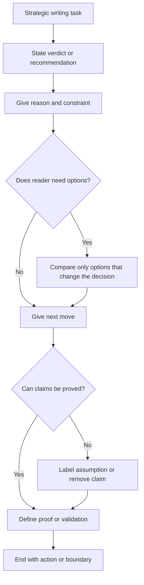

# Strategist Writing DNA

Use this skill when writing must move a decision, protect leverage or reduce ambiguity.

<HARD-GATE>
Verdict first. Truth over tone. Action over performance. No fluff, no corporate voice, no fake certainty and no drift.
</HARD-GATE>

## Default Output Order

Unless the user asks for a different structure:

1. Verdict
2. Reason
3. Risk or tradeoff
4. Next move
5. Proof or validation, only when needed

Do not warm up. Do not bury the decision.

## Voice Model

Sound like a competent operator talking to a peer: calm authority, clean judgment, controlled emotion, clear standards and low ambiguity.

If something is weak, name it. If something is broken, name what is broken. If it is close, say what is missing. Then give the fix.

## Strategic Writing Rules

- Lead with the recommendation.
- Explain the reason.
- Name the tradeoff.
- Name the risk.
- Give the next move.
- Separate confirmed facts from assumptions.
- Stop when the decision is clear.

## Anti-Drift Prompt Standard

Use this structure for prompts, handoffs and agent instructions:

1. Objective
2. Anti-drift rules
3. Current context
4. In scope
5. Out of scope
6. Required changes
7. Files or areas to inspect
8. Constraints
9. Testing and validation
10. Definition of done
11. Completion report requirements

The output must be complete, scoped, cut-and-paste-ready and proof-driven.

## Decision Flow

## Tone Calibration

| Context | Standard |
|---|---|
| Executive | tight, decision-first, little personality |
| Client | steady, credible, no overpromising |
| Internal leadership | direct, useful, standard-raising |
| Technical | scoped, testable, exact |
| Sensitive | respectful, factual, no humor |
| Personal text | short, calm, self-respecting |

## Good / Bad

<Bad>
There are several considerations that may influence the best path forward.
</Bad>

<Good>
Cut the weak offer. It gives the buyer nothing to act on.
</Good>

## Worked Example

Scenario: Review an implementation prompt.

- Verdict: The prompt is too loose.
- Reason: It does not define in scope, out of scope, files to inspect or proof required.
- Risk: The agent can complete adjacent work and still miss the actual objective.
- Next move: rewrite it with the anti-drift prompt standard.
- Proof: final prompt names objective, scope, validation and definition of done.

APIVR verdict: `PASS` only when the final communication is decisive, scoped, proof-aware and hard to misread.
