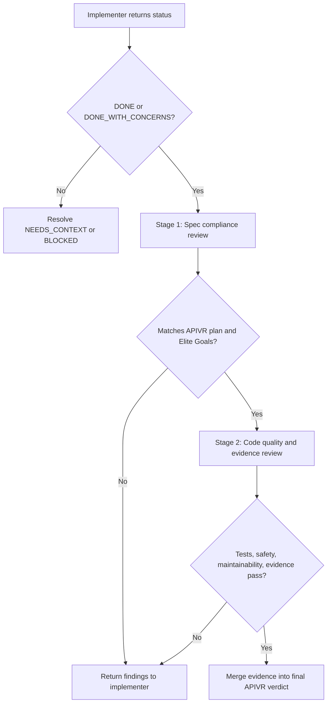

# Subagent Driven Development

Use this skill when work is delegated to one or more agents. First use `skills/dispatching-parallel-agents/SKILL.md` to decide whether dispatch is justified.

<HARD-GATE>
Subagents can produce evidence, patches, findings, and recommendations. They do not override APIVR, Elite Build Goals, source-of-truth order, or release gates.
</HARD-GATE>

## Operating Protocol

1. Orchestrator selects APIVR tier and source-of-truth files.
2. Orchestrator writes exact task scope and stop conditions.
3. Implementer performs only assigned work and reports status.
4. Reviewer Stage 1 checks spec compliance.
5. Reviewer Stage 2 checks code quality, tests, safety, and evidence.
6. Findings route back through APIVR evidence states.
7. Orchestrator merges results and decides next action.

## Implementer Prompt Template

```text
You are the implementer for one APIVR-scoped task.

APIVR tier:
Objective:
Exact files you may edit:
Files you must not edit:
Required source-of-truth files:
Applicable Elite Build Goals:
Required skills:
Test-first requirement:
Implementation steps:
Verification commands:
Evidence ledger fields to return:
Stop if:

Return exactly one status:
- DONE
- DONE_WITH_CONCERNS
- NEEDS_CONTEXT
- BLOCKED
```

## Status Handling

| Status | Meaning | Orchestrator response |
|---|---|---|
| DONE | Scope complete, required evidence supplied, no known unresolved issue. | Send to two-stage review. |
| DONE_WITH_CONCERNS | Work complete but risk, uncertainty, or partial evidence remains. | Send to review and mark evidence Unknown, Not Run, or Blocked where applicable. |
| NEEDS_CONTEXT | Agent cannot continue without specific missing information. | Provide exact context or narrow the scope; do not let agent guess. |
| BLOCKED | Required dependency, permission, evidence, or safety condition prevents progress. | Stop or reroute; record blocker in evidence ledger. |

## Two-Stage Review Gate



Stage 1 checks objective, scope, non-goals, preserved behavior, source-of-truth order, and acceptance criteria.

Stage 2 checks test-first evidence, code quality, security, data safety, rollback, observability, and release gates.

## Review Package

For each review, provide:

- APIVR plan or relevant excerpt.
- Diff or changed-file list.
- Test commands and results.
- Evidence ledger entries.
- Known concerns from implementer.
- Exact review output format: Findings, Evidence State, Required Fixes, Verdict.

Optional helper: use `scripts/make-review-package.py` to assemble a consistent Markdown review package from a plan excerpt, diff/changed-file list, evidence excerpt, and implementer concerns. Do not use the helper as a substitute for reviewer judgment.

## Worked Example

Scenario: A feature requires deployment changes, a webhook, and a dashboard update.

1. Orchestrator dispatches three implementers with non-overlapping scopes.
2. Webhook implementer returns `DONE_WITH_CONCERNS` because provider sandbox verification is unavailable.
3. Stage 1 review passes spec compliance.
4. Stage 2 marks provider evidence `Blocked`, requires contract tests and logs a release-gate risk.
5. Orchestrator allows staging merge but blocks production verdict until provider verification is completed or explicitly accepted.

APIVR result: implementation can be partially complete while release remains blocked.
