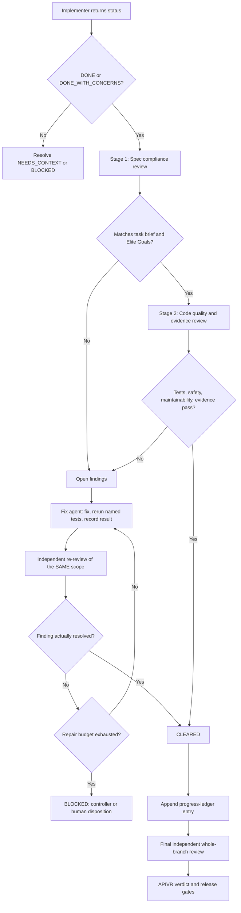

# Subagent Driven Development

Use this skill when work is delegated to one or more agents. First use `skills/dispatching-parallel-agents/SKILL.md` to decide whether dispatch is justified at all.

<HARD-GATE>
Subagents can produce evidence, patches, findings, and recommendations. They do not override APIVR, Elite Build Goals, source-of-truth order, or release gates.

A fix attempt does not clear a finding. A finding is `CLEARED` only after an independent re-review of the same scope.
</HARD-GATE>

## Canonical Ownership

This file owns the controller state machine. The prompts, schemas, templates, and scripts below **implement** this contract and may not redefine it.

| Concern | Canonical file |
|---|---|
| Controller state machine | this file |
| Role contracts | `skills/subagent-driven-development/prompts/implementer-prompt.md`, `skills/subagent-driven-development/prompts/task-reviewer-prompt.md`, `skills/subagent-driven-development/prompts/fix-agent-prompt.md`, `skills/subagent-driven-development/prompts/final-reviewer-prompt.md` |
| Artifact rules | `skills/subagent-driven-development/ARTIFACT_CONTRACT.md` |
| Artifact schemas | `skills/subagent-driven-development/schemas/` |
| Exact review packages | `skills/subagent-driven-development/scripts/make-review-package.py` |
| Runtime capability and fallbacks | `runtime_adapters/CAPABILITY_MATRIX.md` |

## Controller Loop

```text
Resolve source of truth and APIVR tier
  -> capture plan_base_sha
  -> pre-flight conflict scan across all tasks and global constraints
  -> present one consolidated conflict report
  -> create durable task brief
  -> capture task_base_sha before dispatch
  -> implement test-first
  -> implementer self-review and covering-test rerun
  -> capture task_head_sha
  -> generate exact base..head review package
  -> independent task review
  -> material findings enter the fix loop
  -> fixer reruns named covering tests and records evidence
  -> same scope receives independent re-review
  -> update durable progress ledger
  -> repeat for remaining tasks
  -> independent final whole-branch review of plan_base_sha..branch_head_sha
  -> APIVR verification and release-gate decision
```

## 1. Pre-Flight Conflict Scan

Run this **before task 1**. Do not dispatch any implementer until it completes.

Scan all tasks and global constraints for:

- contradictory acceptance criteria;
- duplicate edits to the same canonical file;
- incompatible file ownership;
- invalid or impossible test requirements;
- sequencing and dependency conflicts;
- overlapping task scopes;
- incompatible preserved-behavior requirements;
- conflicting support-level or adapter claims;
- missing source-of-truth files;
- requirements that would force an agent to guess.

Present **one consolidated batch** to the human. Record the outcome in `preflight-conflict-report.md` using `60_templates/PRE_FLIGHT_CONFLICT_REPORT_TEMPLATE.md`. Unresolved material conflicts block implementation.

## 2. Task Brief

Every task gets a durable brief before dispatch. Use `60_templates/TASK_BRIEF_TEMPLATE.md`.

Exact requirements live in the brief. Do not paste them repeatedly into prompts. The brief is immutable after dispatch; a correction creates a new revision with a reason and timestamp.

## 3. Base And Head Capture

The controller records `task_base_sha` **before dispatch** and `task_head_sha` when the implementer returns.

Generate the review package from that exact range:

```bash
python3 skills/subagent-driven-development/scripts/make-review-package.py \
  --repo . --task-brief <brief> --base <task_base_sha> --head <task_head_sha> \
  --implementer-report <report> --global-constraints <constraints> --output-dir <dir>
```

Shortcut refs are prohibited. Never use `HEAD~1` or any `~`/`^` form to derive a review range: it silently omits earlier commits in a multi-commit task. The helper rejects them, rejects an identical base and head, rejects a non-ancestor base, and rejects a dirty worktree unless `--include-working-tree` is explicitly given.

## 4. Implementer Statuses

| Status | Meaning | Controller response |
|---|---|---|
| DONE | Scope complete, self-review done, covering tests rerun and recorded. | Send to independent task review. |
| DONE_WITH_CONCERNS | Complete, but risk, uncertainty, or partial evidence remains. | Review, and mark evidence `Unknown`, `Not Run`, or `Blocked` where applicable. |
| NEEDS_CONTEXT | Cannot continue without specific missing information. | Supply exact context or narrow scope. Never let the agent guess. |
| BLOCKED | Dependency, permission, evidence, or safety condition prevents progress. | Stop or reroute; record the blocker in the evidence ledger. |

`DONE` is invalid without the self-review and covering-test evidence required by `prompts/implementer-prompt.md`.

## 5. Finding And Repair State Machine

### Severities

`BLOCKING` · `CRITICAL` · `IMPORTANT` · `MINOR` · `OBSERVATION`

### States

`OPEN` · `FIXED_PENDING_REVIEW` · `CLEARED` · `CANNOT_VERIFY_FROM_DIFF` · `ACCEPTED_RISK` · `BLOCKED`

### Binding transitions

```text
OPEN
  -> FIXED_PENDING_REVIEW only after a fix report and covering-test evidence exist
  -> CANNOT_VERIFY_FROM_DIFF when required evidence is outside the package
  -> ACCEPTED_RISK only through explicit authorized disposition

FIXED_PENDING_REVIEW
  -> CLEARED only after independent re-review of the same scope
  -> OPEN when the re-review fails
  -> BLOCKED when the repair budget is exhausted or evidence cannot be obtained

CANNOT_VERIFY_FROM_DIFF
  -> OPEN when additional context reveals a defect
  -> CLEARED only after additional evidence and re-review
  -> BLOCKED when required evidence remains unavailable
```

### Material-finding rule

Every `BLOCKING`, `CRITICAL`, or `IMPORTANT` finding must complete:

**fix -> named covering tests -> recorded command and result -> same-scope independent re-review**

A fix attempt does not clear a finding. A reviewer may not close a finding because a fix was attempted, described, or claimed.

### Repair budget

- Default maximum: **three repair rounds per finding**.
- The task brief may set a lower or higher bound based on risk.
- Exhausting the budget sets the task to `BLOCKED` and requires controller or human disposition.
- The controller may **not** silently downgrade severity to escape the budget.

### Uncertainty rule

`CANNOT_VERIFY_FROM_DIFF` maps to the existing evidence state `Unknown`. The controller must resolve each item using cross-task context before marking the task complete. Uncertainty may not disappear silently, and it blocks a final `PASS` under the existing rules in `10_governance/RELEASE_GATES.md` until resolved or explicitly accepted.

## 6. Review Neutrality

Review prompts and packages may **not**:

- tell the reviewer not to flag a category of valid issue;
- assert that the implementation is correct before review;
- pre-downgrade likely severity;
- omit binding project constraints;
- summarize a constraint in a way that changes its meaning.

Binding constraints are copied **verbatim** into the review package.

Reviewers must be independent of implementation. Where the runtime has no independent subagent, use the exact fallback in the active runtime manifest, and report the degraded independence explicitly. A fresh-context sequential pass is a substitute, not an equal.

## 7. Capability Selection

Use portable capability classes, not vendor model names.

| Work | Minimum capability |
|---|---|
| Low-risk, narrow implementation | Standard implementer |
| Multi-file, stateful, security-sensitive, migration, integration, or architecture task | Advanced implementer |
| Task review | Equal to or stronger than the implementer, independent context |
| Critical repair review | Advanced reviewer |
| Final cumulative branch review | Strongest available reviewer |

## 8. Context-Cost Control

Large plans, diffs, logs, and reports stay on disk. Controller messages carry **paths and concise status only**, not pasted content. This is a file-based handoff, and it is what makes long runs recoverable. See `ARTIFACT_CONTRACT.md`.

## 9. Final Whole-Branch Review

After every task-level review passes, run **one independent review of the complete cumulative change**: `plan_base_sha..branch_head_sha`.

This is APIVR Phase 4 at branch scope, not a seventh phase. It exists to catch cross-task defects that task-scoped reviewers structurally cannot see.

The final review package must contain: original plan; global constraints; plan base SHA; branch head SHA; cumulative diff and changed-file inventory; the progress ledger; all open, cleared, accepted-risk, and blocked findings; the task-level test matrix; final verification commands and results; unresolved implementer concerns; and rollback conditions.

Use `prompts/final-reviewer-prompt.md` and `60_templates/FINAL_BRANCH_REVIEW_TEMPLATE.md`.

No APIVR completion or release claim may be made before this review passes, or an authorized non-critical risk is explicitly accepted.

## 10. Progress Ledger

Every task appends one entry to `progress-ledger.jsonl` (`60_templates/PROGRESS_LEDGER_TEMPLATE.jsonl`, schema `schemas/progress-ledger.schema.json`). The ledger is the recoverability artifact: it feeds `60_templates/EVIDENCE_LEDGER_TEMPLATE.md` and `60_templates/COMPLETION_REPORT_TEMPLATE.md`.

## Two-Stage Task Review Gate



Stage 1 checks objective, scope, non-goals, preserved behavior, source-of-truth order, and acceptance criteria.
Stage 2 checks test-first evidence, code quality, security, data safety, rollback, observability, and release gates.

## Worked Example

Scenario: a feature requires deployment changes, a webhook, and a dashboard update.

1. Controller captures `plan_base_sha`, runs the pre-flight scan, and finds that two tasks both edit the same route file. It presents the conflict and the human splits ownership.
2. Three task briefs are written. Each records its `task_base_sha` before dispatch.
3. The webhook implementer returns `DONE_WITH_CONCERNS`: provider sandbox verification is unavailable.
4. The exact `base..head` package is generated. The task reviewer opens one `CRITICAL` finding with file-and-line evidence, and marks provider verification `CANNOT_VERIFY_FROM_DIFF`.
5. The fix agent addresses the `CRITICAL`, reruns the named covering tests, records the command and result, and returns `FIXED_PENDING_REVIEW`. The same scope is re-reviewed and the finding becomes `CLEARED`.
6. The `CANNOT_VERIFY_FROM_DIFF` item maps to evidence state `Unknown` and remains open.
7. The final whole-branch review catches that the dashboard task weakened an assertion the webhook task depended on. That finding returns to the fix loop.
8. Release gates block production `PASS` while provider evidence is `Unknown`.

APIVR result: implementation can be complete while release remains blocked. That is the correct outcome, honestly reported.

## Closeout

End with: APIVR tier, what was inspected, what changed, verification performed or marked `Not Run` / `Blocked`, the final verdict, and the single next required action.
