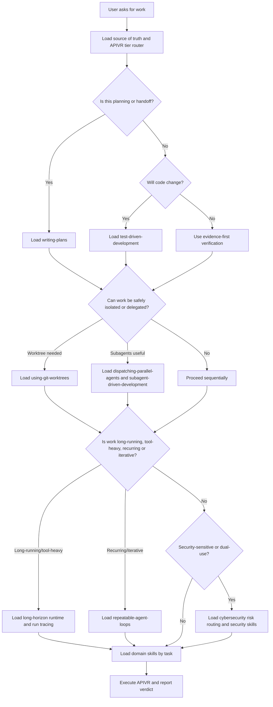

# Super Build Kit

This skill is the first orientation layer for the portable Super Build Kit operating system. Use it to decide which APIVR files, skills, templates, and specialist roles must govern the task.

## Required Activation

Read these files in order:

1. `00_start_here/START_HERE.md`
2. `00_start_here/SOURCE_OF_TRUTH.md`
3. `00_start_here/LOAD_ORDER.md`
4. `50_audits/AUDIT_TIER_ROUTER.md`

Then load only the task-specific files named by `LOAD_ORDER.md`.

## Skill Invocation Flow

For implementation plans, feature work, refactors, fixes, or risky edits:

- Load `skills/writing-plans/SKILL.md` before plan creation.
- Load `skills/20-pass-protocol/SKILL.md` before finalizing high-stakes prompts, agents, skills, source files, plans, audits, runbooks, templates, release instructions, or other accuracy-critical artifacts.
- Load `skills/test-driven-development/SKILL.md` before APIVR Phase 3 code work.
- Load `skills/using-git-worktrees/SKILL.md` and prefer native worktree tooling before manual git fallback.
- Load `skills/dispatching-parallel-agents/SKILL.md` and `skills/subagent-driven-development/SKILL.md` before dispatching delegated work. `skills/subagent-driven-development/SKILL.md` owns the deterministic controller protocol: pre-flight conflict scan, durable task briefs, exact base..head review packages, mandatory fix and re-review of material findings, bounded repair budgets, and a final independent whole-branch review.
- Load `runtime_adapters/PORTABILITY_CONTRACT.md` before adapter design, installation, update, troubleshooting, or porting work, and before claiming any runtime support level or capability fallback.
- Load `skills/repeatable-agent-loops/SKILL.md` before recurring audits, iterative remediation, quality sweeps, monitors, post-deploy stabilization checks, or any repeat-until-stable workflow.
- Load `skills/long-horizon-agent-runtime/SKILL.md` and `skills/agent-observability-and-run-tracing/SKILL.md` before long-running, multi-stage, tool-heavy, artifact-heavy, Comprehensive, Forensic, or handoff-sensitive work.
- Load `skills/project-bootstrap-and-setup/SKILL.md` before install, bootstrap, config, first-run, dependency, or setup work.
- Load `skills/mcp-tool-governance/SKILL.md` before enabling, configuring, or auditing MCP servers, plugin tools, connectors, tool auth, or permission boundaries.
- Load `skills/cybersecurity-risk-routing/SKILL.md` before cybersecurity, app security, AI security, incident response, supply-chain, vulnerability, scanning, red-team, phishing, credential, malware, prompt injection, MCP probing, or other dual-use work.
- Load `skills/ai-application-security/SKILL.md` for LLM apps, RAG, vector stores, prompt injection, system prompt leakage, model routing, AI tool abuse, or AI data leakage.
- Load `skills/security-incident-response/SKILL.md` for alerts, suspected compromise, exfiltration, ransomware, malware, unauthorized access, containment, recovery, or forensic security work.
- Load `skills/supply-chain-and-build-provenance/SKILL.md` for dependencies, CI/CD, SBOMs, containers, IaC, signatures, provenance, package publishing, or release artifact trust.

For deployment, hosting, scheduling, automation, reporting, external APIs, media/assets, UI/UX, frontend design, writing, copy, or strategic communication, load the corresponding specialist skill from `skills/` plus its `40_knowledge/` module or template before planning implementation.

## Platform Activation

| Platform | First action |
|---|---|
| Codex | Use `skills/super-build-kit/SKILL.md`, then follow `00_start_here/LOAD_ORDER.md`. |
| Claude / Claude Code | Read `START_HERE.md`, `SOURCE_OF_TRUTH.md`, `LOAD_ORDER.md`, then this skill. |
| Gemini CLI | Load this repository as context and start with the Always Load list. |
| Replit Agent | Read `REPLIT.md`, then this skill and the task-specific skills. |
| Cursor | Use `.cursor/rules/super-build-kit.mdc`, then follow this skill. |
| Copilot | Use `.github/copilot-instructions.md`, then follow this skill. |

## Skill Priority Order

1. Source of truth: APIVR and Elite Build Goals.
2. Audit tier and release gates.
3. Worktree/isolation rules when files may change.
4. Writing plans and TDD for implementation.
5. 20 Pass Protocol when precision failure is expensive.
6. Dispatch/subagent protocol when work is split.
7. Long-horizon run control, workspace boundaries, and trace rules when work spans stages, tools, artifacts, or handoffs.
8. Repeatable loop rules when work is recurring, iterative, monitor-like, or bounded by a stop condition.
9. Bootstrap/setup and MCP/tool governance when runtime setup or tool access matters.
10. Cybersecurity routing and security-specific skills when safety, auth, privacy, AI security, incidents, supply chain, or dual-use work matters.
11. Domain skills for deployment, automation, reporting, APIs, and assets.
12. UI/UX design quality and writing quality skills when user-facing experience or communication quality matters.
13. Evidence templates and completion reports.

## Rationalization Rebuttals

| Rationalization | APIVR violation |
|---|---|
| This is too small for the kit. | Tier selection skipped. |
| I know the answer already. | Phase 1 audit skipped. |
| I can plan in my head. | Phase 2 evidence missing. |
| I made it better but did not run the precision pass. | High-stakes artifact review skipped. |
| Tests are optional here. | Phase 3 TDD gate violated unless non-applicability is proved. |
| I will verify at the end. | Incremental evidence missing. |
| Deployment is separate. | Release gate disconnected from implementation. |
| A subagent said it passed. | Final APIVR verdict improperly delegated. |
| I can let it keep trying until it works. | Loop stop condition and iteration budget missing. |
| The chat history is the trace. | Durable evidence and run trace missing. |
| Setup is harmless. | Config, secret, dependency, or production boundary not audited. |
| The tool is already installed. | Tool permission, auth, overlap, and evidence source not checked. |
| This is just a security test. | Authorization, scope, and dual-use gate missing. |
| The prompt is secret, so we are safe. | Prompt used as security boundary; server-side control missing. |
| The artifact built successfully. | Supply-chain provenance and release evidence missing. |
| The provider docs are obvious. | External dependency evidence Unknown. |
| The asset looks fine. | Rendered/rights evidence missing. |
| The user is in a hurry. | Risk acceptance not recorded. |

## Mandatory Behavior

- State the APIVR tier before implementation or release claims.
- Apply the relevant Elite Build Goals.
- Use evidence states for material claims.
- Write zero-placeholder plans for Standard and above.
- Use the 20 Pass Protocol before finalizing high-stakes prompts, agents, skills, source files, plans, audits, runbooks, templates, release instructions, or other accuracy-critical artifacts.
- Enforce test-first implementation for code changes unless APIVR records automated testing as non-applicable with reason.
- Enforce loop design, receipts, stop conditions, and iteration budgets for repeatable agent loops.
- Enforce long-horizon checkpoints, workspace/artifact boundaries, context-preservation rules, and run traces for staged or serious work.
- Enforce setup boundaries before install/config/first-run work and MCP/tool governance before tool access changes.
- Enforce cybersecurity routing, authorization gates, security evidence ledgers, and dual-use stop conditions before security-sensitive or offensive-capable work.
- Enforce AI security review for LLM apps, RAG, vector stores, prompts, models, and tool-using agents.
- Enforce incident evidence preservation and supply-chain provenance checks when applicable.
- Enforce UI/UX design briefs, anti-generic checks, accessibility gates and rendered verification for user-facing interface work.
- Enforce anti-AI writing quality and strategist voice rules for copy, reports, prompts and decision-facing communication.
- Run implementation audit and verification before calling work complete.
- Stop instead of guessing when required evidence or authorization is missing.

## Worked Example

Scenario: Build a webhook-backed reporting feature.

1. Load APIVR source of truth and select Comprehensive tier because external APIs, automation, reporting, and possible revenue/customer impact are involved.
2. Load `writing-plans`, `test-driven-development`, `external-api-integration`, `scheduling-and-automation-routing`, and `data-output-and-reporting`.
3. Write a plan with failing tests for webhook idempotency and report generation.
4. Implement Red-Green-Refactor.
5. Run two-stage review if delegated.
6. Verify sandbox/provider behavior, reporting accuracy, logs, rollback, and release gates.
7. Final APIVR verdict states evidence, blockers, and release status.

## Final Output

End with APIVR verdict, evidence summary, release-gate status when applicable, and the single next required action.
