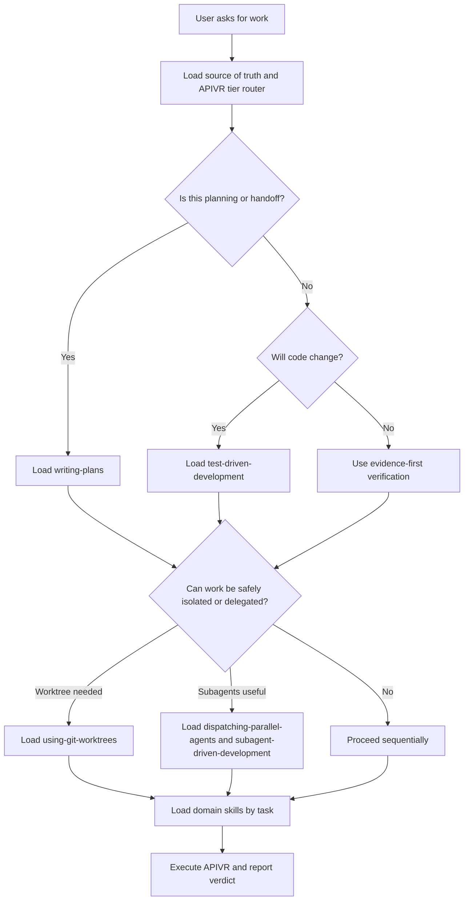

# Super Build Kit

This skill is the first orientation layer for the portable Super Build Kit operating system. Use it to decide which APIVR files, skills, templates, and specialist roles must govern the task.

## Required Activation

Read these files in order:

1. `00_start_here/START_HERE.md`
2. `00_start_here/SOURCE_OF_TRUTH.md`
3. `00_start_here/LOAD_ORDER.md`
4. `50_audits/AUDIT_TIER_ROUTER.md`

Then load only the task-specific files named by `LOAD_ORDER.md`.

## Skill Invocation Flow

For implementation plans, feature work, refactors, fixes, or risky edits:

- Load `skills/writing-plans/SKILL.md` before plan creation.
- Load `skills/test-driven-development/SKILL.md` before APIVR Phase 3 code work.
- Load `skills/using-git-worktrees/SKILL.md` and prefer native worktree tooling before manual git fallback.
- Load `skills/dispatching-parallel-agents/SKILL.md` and `skills/subagent-driven-development/SKILL.md` before dispatching delegated work.

For deployment, hosting, scheduling, automation, reporting, external APIs, media/assets, UI/UX, frontend design, writing, copy, or strategic communication, load the corresponding specialist skill from `skills/` plus its `40_knowledge/` module or template before planning implementation.

## Platform Activation

| Platform | First action |
|---|---|
| Codex | Use `skills/super-build-kit/SKILL.md`, then follow `00_start_here/LOAD_ORDER.md`. |
| Claude / Claude Code | Read `START_HERE.md`, `SOURCE_OF_TRUTH.md`, `LOAD_ORDER.md`, then this skill. |
| Gemini CLI | Load this repository as context and start with the Always Load list. |
| Replit Agent | Read `REPLIT.md`, then this skill and the task-specific skills. |
| Cursor | Use `.cursor/rules/super-build-kit.mdc`, then follow this skill. |
| Copilot | Use `.github/copilot-instructions.md`, then follow this skill. |

## Skill Priority Order

1. Source of truth: APIVR and Elite Build Goals.
2. Audit tier and release gates.
3. Worktree/isolation rules when files may change.
4. Writing plans and TDD for implementation.
5. Dispatch/subagent protocol when work is split.
6. Domain skills for deployment, automation, reporting, APIs, and assets.
7. UI/UX design quality and writing quality skills when user-facing experience or communication quality matters.
8. Evidence templates and completion reports.

## Rationalization Rebuttals

| Rationalization | APIVR violation |
|---|---|
| This is too small for the kit. | Tier selection skipped. |
| I know the answer already. | Phase 1 audit skipped. |
| I can plan in my head. | Phase 2 evidence missing. |
| Tests are optional here. | Phase 3 TDD gate violated unless non-applicability is proved. |
| I will verify at the end. | Incremental evidence missing. |
| Deployment is separate. | Release gate disconnected from implementation. |
| A subagent said it passed. | Final APIVR verdict improperly delegated. |
| The provider docs are obvious. | External dependency evidence Unknown. |
| The asset looks fine. | Rendered/rights evidence missing. |
| The user is in a hurry. | Risk acceptance not recorded. |

## Mandatory Behavior

- State the APIVR tier before implementation or release claims.
- Apply the relevant Elite Build Goals.
- Use evidence states for material claims.
- Write zero-placeholder plans for Standard and above.
- Enforce test-first implementation for code changes unless APIVR records automated testing as non-applicable with reason.
- Enforce UI/UX design briefs, anti-generic checks, accessibility gates and rendered verification for user-facing interface work.
- Enforce anti-AI writing quality and strategist voice rules for copy, reports, prompts and decision-facing communication.
- Run implementation audit and verification before calling work complete.
- Stop instead of guessing when required evidence or authorization is missing.

## Worked Example

Scenario: Build a webhook-backed reporting feature.

1. Load APIVR source of truth and select Comprehensive tier because external APIs, automation, reporting, and possible revenue/customer impact are involved.
2. Load `writing-plans`, `test-driven-development`, `external-api-integration`, `scheduling-and-automation-routing`, and `data-output-and-reporting`.
3. Write a plan with failing tests for webhook idempotency and report generation.
4. Implement Red-Green-Refactor.
5. Run two-stage review if delegated.
6. Verify sandbox/provider behavior, reporting accuracy, logs, rollback, and release gates.
7. Final APIVR verdict states evidence, blockers, and release status.

## Final Output

End with APIVR verdict, evidence summary, release-gate status when applicable, and the single next required action.
