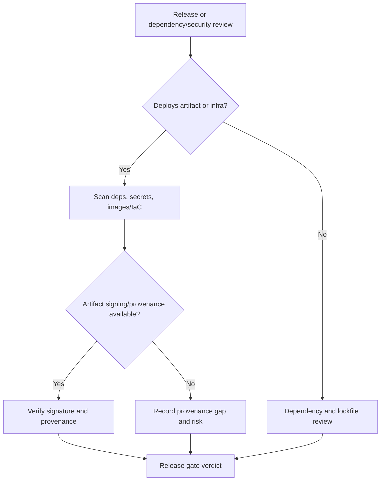

# Supply Chain And Build Provenance

Use this skill when release trust depends on what was built, where it came from, how it was built, and whether dependencies or artifacts are safe enough to ship.

<HARD-GATE>
Do not release production artifacts when provenance, dependency integrity, secret exposure, or critical vulnerability evidence is unknown for systems where supply-chain compromise would be material.
</HARD-GATE>

## Required Files

- `40_knowledge/SECURITY_FRAMEWORK_MAPPING.md`
- `60_templates/SECURITY_EVIDENCE_LEDGER_TEMPLATE.md`
- `10_governance/RELEASE_GATES.md`

## APIVR Routing

- Phase 1 Audit: identify source repo, lockfiles, package managers, CI/CD, container/IaC targets, artifact registry, signing, and deployment path.
- Phase 2 Plan: choose scans, provenance checks, thresholds, exceptions, and release gates.
- Phase 3 Implement: scan, verify, remediate, sign, or document exceptions.
- Phase 4 Audit Implementation: check changed dependencies, CI config, generated artifacts, and credentials.
- Phase 5 Verify Implementation: verify scans/provenance/signatures or record `Not Run` / `Blocked`.
- Phase 6 Re-Audit: record residual CVEs, accepted risk owners, expiration, and reversal triggers.

## Supply Chain Checklist

| Area | Check |
|---|---|
| Dependencies | Lockfiles present, unexpected dependency changes reviewed, known critical CVEs handled. |
| Secrets | Repository, image, and IaC secret scans are run or explicitly marked. |
| Containers/IaC | Image, Dockerfile, Kubernetes, Terraform, Helm, or cloud config scans as applicable. |
| SBOM | SBOM generated or absence justified for material releases. |
| Provenance | Build source, builder identity, commit/tag, artifact identity, and signature/attestation verified where available. |
| CI/CD | Workflow permissions, OIDC, actions pinning, secret exposure, and deploy boundaries reviewed. |
| Exceptions | Residual risks include owner, reason, compensating control, expiration, and reversal trigger. |

## Decision Flow

## Worked Example

Scenario: Release a containerized app to production.

1. Select Comprehensive because production artifact and dependencies are in scope.
2. Scan dependencies and image for high/critical vulnerabilities and secrets.
3. Check Dockerfile and Kubernetes/IaC misconfigurations.
4. Verify image provenance/signature when configured.
5. Block release on unaccepted critical vulnerabilities, exposed secrets, or unknown artifact source.
6. Record accepted non-critical risk with owner and expiration.

## Final Output

Report dependency/artifact scope, scans run, signature/provenance status, vulnerabilities and exceptions, release gates, residual risk, and APIVR verdict.
