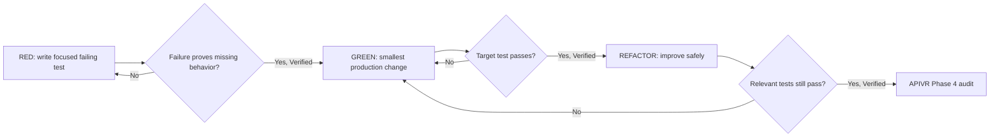

# Test Driven Development

Use this skill during APIVR Phase 3 for code work.

<EXTREMELY-IMPORTANT>
Iron Law: no production code change without a failing test or an explicitly documented evidence-first substitute approved by APIVR tier logic.
</EXTREMELY-IMPORTANT>

If production code was written before the failing test, stop, preserve notes if useful, revert or quarantine the premature production change, write the failing test, and restart from Red.

## APIVR Integration

- Phase 1 Audit: identify behavior, risk, current coverage, and test surface.
- Phase 2 Plan: embed the failing test or executable verification in the plan.
- Phase 3 Implement: run Red-Green-Refactor.
- Phase 4 Audit Implementation: inspect tests for false confidence, weak assertions, skipped paths, and fixture abuse.
- Phase 5 Verify Implementation: run targeted and relevant broader checks.
- Phase 6 Re-Audit: confirm no collateral regression or unverified claim remains.

## Red-Green-Refactor Evidence Cycle

Evidence after each phase must use the kit evidence language: Verified, Likely, Suspected, Unknown, Not Run, or Blocked. If automation is genuinely non-applicable, record an applicability note plus the best available evidence state. Do not treat manual inspection as Verified automated behavior.

## Required Checklist

- Failing test exists before production change.
- Failure was observed and matches the intended behavior.
- Production change is the smallest safe change.
- Targeted test passes after implementation.
- Relevant neighboring tests pass or are explicitly risk-accepted.
- Refactor does not change behavior beyond the plan.
- No skipped, weakened, deleted, or snapshot-only tests hide the risk.
- Evidence ledger records command, result, and remaining risk.

## Rationalization Table

| Rationalization | APIVR violation | Required response |
|---|---|---|
| I already manually tested it. | Not Run for automated evidence. | Add automated test or record why only manual evidence is valid. |
| This is too small to test. | Unsupported material claim. | Write the smallest behavior test or document non-applicability with alternate evidence. |
| Tests will take longer than the fix. | Phase 2 plan gap. | Narrow the test; do not skip the gate. |
| Existing tests probably cover it. | Unknown evidence. | Identify and run the exact covering test. |
| I will add tests after. | Phase 3 order violation. | Stop and write failing test first. |
| It is just refactoring. | Regression evidence missing. | Run characterization tests before changing structure. |
| The UI proves it works. | Partial evidence only. | Add component/e2e/API test as appropriate. |
| The provider sandbox is unavailable. | Blocked external evidence. | Use contract tests/mocks and record provider verification as blocked. |
| The test is flaky. | Verification unreliable. | Stabilize or isolate before claiming Verified. |
| The deadline is urgent. | Release gate pressure. | Use Rapid tier only if risk permits; record explicit acceptance. |

## Good / Bad

<Bad>
Fix the bug, click through the page, then add a broad snapshot test.
</Bad>

<Good>
Write `rejects expired reset token` first, run it and observe failure, implement token expiry validation, rerun the targeted test, then run the auth regression suite.
</Good>

## Worked Example

Scenario: A scheduled report sends duplicate emails.

1. Red: add a test proving two scheduler invocations with the same report date enqueue one email.
2. Verified Red: command fails because duplicate prevention does not exist.
3. Green: add idempotency key based on report id and scheduled window.
4. Verified Green: targeted test passes.
5. Refactor: extract idempotency helper without changing behavior.
6. Verified Refactor: targeted and reporting tests pass.
7. APIVR verdict: `PASS` only if duplicate prevention, scheduler behavior, and reporting evidence are Verified.

## Reference

Read `references/testing-anti-patterns.md` when tests pass too easily, assertions feel weak, snapshots dominate, mocks replace the behavior under test, or a reviewer questions test quality.
