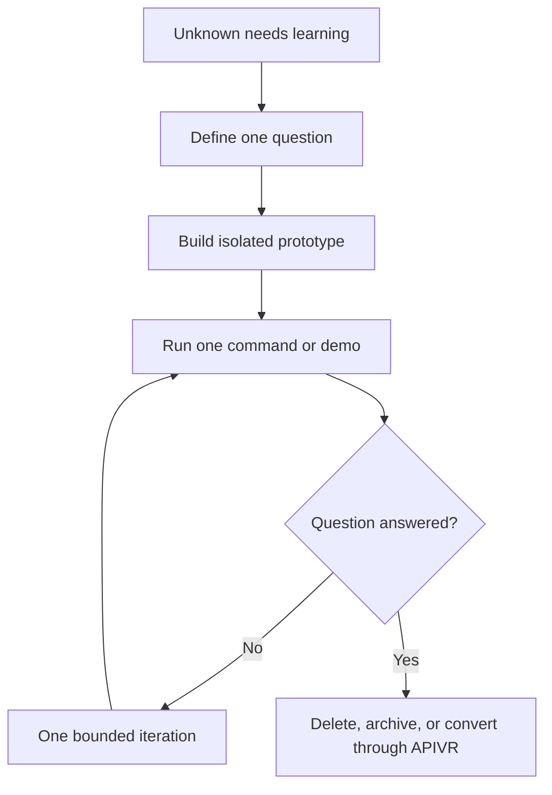

# Throwaway Prototyping

Use this skill when the goal is learning.

<HARD-GATE>
Mark prototypes as throwaway before writing them. Do not let prototype code silently become production code.
</HARD-GATE>

## Prototype Contract

- Question being answered:
- Time or iteration budget:
- Files or sandbox location:
- One command to run:
- What evidence decides success:
- What must be deleted, archived, or absorbed:
- What cannot be reused without APIVR review:

## Flow

## Worked Example

Scenario: Test whether a provider supports webhook replay.

- Prototype question: can sandbox replay signed events with stable ids?
- Location: isolated `scratch/provider-replay-prototype`.
- Evidence: replay command output and observed payload.
- Production rule: no prototype code enters `src/` until a new APIVR plan adds tests, secrets handling, and rollback.

