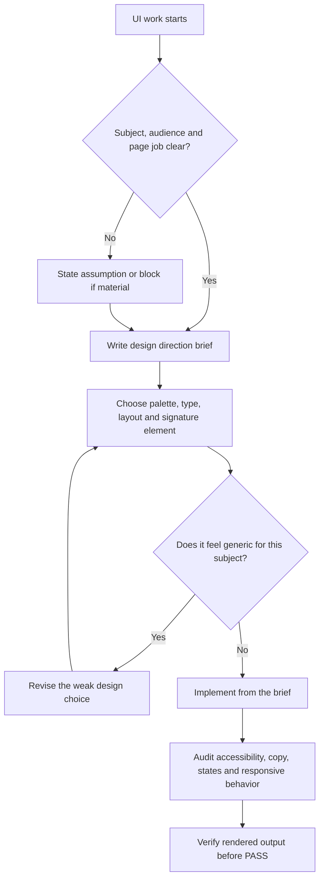

# UI/UX Design Quality

Use this skill whenever the work changes what a user sees, reads, clicks, scans or navigates.

<HARD-GATE>
Do not build generic AI-looking UI. Define the subject, audience, page job, visual direction and proof standard before writing interface code.
</HARD-GATE>

## Required References

- Read `40_knowledge/UI_UX_DESIGN_SYSTEM_GUIDANCE.md` for design-system, accessibility, dashboard and anti-pattern guidance.
- Use `60_templates/DESIGN_DIRECTION_BRIEF_TEMPLATE.md` for Standard and above UI work.
- Use `60_templates/UI_UX_REVIEW_CHECKLIST.md` before final UI delivery.

## APIVR Routing

- Phase 1 Audit: inspect current UI, target audience, user task, brand constraints, content, accessibility risk and existing design system.
- Phase 2 Plan: write a design direction brief with palette, type, layout, signature element, microcopy standard and verification plan.
- Phase 3 Implement: build from the brief, using local patterns and test-first behavior where code changes apply.
- Phase 4 Audit Implementation: compare UI against the brief, design system, accessibility gates and anti-generic checks.
- Phase 5 Verify Implementation: inspect rendered output in target viewports and run relevant automated checks.
- Phase 6 Re-Audit: record the final design baseline and follow-up risks.

## Design Decision Flow

## Core Rules

- Ground the design in the subject matter, not the agent's default taste.
- Spend boldness in one place. Keep everything else disciplined.
- Treat copy as interface design.
- Use real content or realistic content. Placeholder filler weakens design decisions.
- Use familiar controls for familiar actions.
- Preserve accessibility, contrast, keyboard focus, reduced motion and responsive behavior.
- Do not claim visual quality without rendered review when a renderer is available.

## Anti-Generic UI Gate

Before coding, ask:

- Would this design work unchanged for a totally different business?
- Are the palette, type and layout defaults rather than choices?
- Is the hero a real thesis or just a decorative opener?
- Does the signature element serve the product or only decorate it?
- Is motion useful, or just proof that animation was available?

If the answer exposes generic design, revise before implementation.

## Good / Bad

<Bad>
Use a generic dark hero, vague headline, floating cards, purple gradient and three feature boxes.
</Bad>

<Good>
For a local dental practice, use calm clinical whites, soft blue-gray accents, clear appointment-first navigation, patient reassurance copy, insurance/payment clarity and a booking flow visible above the fold.
</Good>

## Worked Example

Scenario: Build a SaaS dashboard page.

- APIVR tier: Standard unless private data, revenue, auth or production release risk raises it.
- Design brief: operator dashboard for daily decisions, not a marketing page.
- Direction: dense but calm layout, clear hierarchy, restrained color, chart labels that explain decisions, visible empty/error/loading states.
- Verification: inspect 375, 768, 1024 and 1440 widths; check keyboard focus, contrast, chart labels, table fallback and no overlap.
- Verdict: `PASS` only when user task, accessibility, responsiveness, copy and rendered output are Verified.
