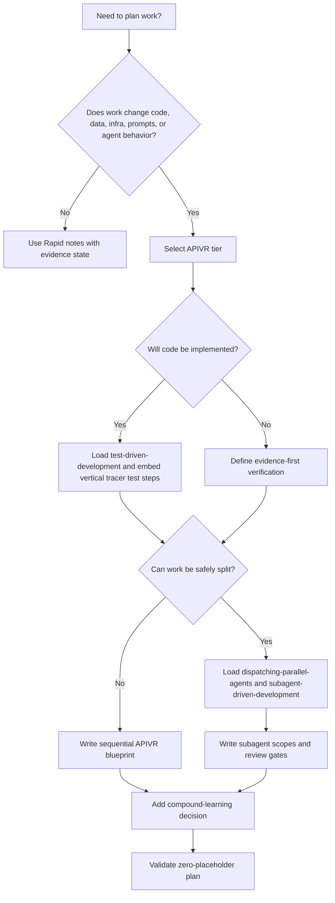

# Writing Plans

Use this skill during APIVR Phase 2. A plan is acceptable only when a competent agent can execute it without inventing missing decisions.

<HARD-GATE>
Do not produce a vague plan. Do not use placeholders such as TBD, later, as needed, fix tests, update files, handle edge cases, clean up docs, wire things together, improve quality, or similar unsized work. If information is unknown, name the exact discovery step that will make it known.
</HARD-GATE>

## Required Inputs

- APIVR tier and applicable Elite Build Goals.
- Objective, non-goals, acceptance criteria, and affected users/systems.
- Product premise, user/buyer, highest-risk assumption, success metric, and vertical slice when product strategy is involved.
- Canonical domain terms, states, events, and ADR requirements when durable vocabulary or decisions are involved.
- Exact files, commands, APIs, routes, schemas, assets, providers, jobs, or deployment surfaces in scope.
- Evidence required for each material claim.
- Rollback or restoration path for Standard and above.
- Compound-learning decision for Standard and above: what kind of outcome would update canonical guidance, create a solved-problem lesson, or require no durable learning.

## Plan Structure

1. State APIVR tier and why that tier is sufficient.
2. List applicable Elite Build Goals and their effect on the plan.
3. Summarize current state from observed files or systems.
4. Define in scope, out of scope, preserved behavior, and smallest safe change.
5. Define domain glossary or ADR outputs when language or durable decisions affect the work.
6. Split large work into vertical, independently verifiable slices.
7. Run a pre-flight contradiction scan before execution: compare objective, non-goals, acceptance criteria, global constraints, tests, release gates, and task slices for conflicts or review-blocking instructions.
8. Write concrete implementation steps with exact file paths.
9. For code work, embed the failing test or test-case skeleton before production-code steps.
10. Add engineering plan review, code review, QA, release readiness, and DevEx review steps when applicable.
11. Add verification commands, manual checks, evidence states, and expected results.
12. Add rollback triggers and restoration steps.
13. Add compound-learning capture or knowledge-refresh decision for Standard and above work.
14. Add challenge-review questions for Important, Critical, Comprehensive, or Forensic work.
15. Apply `skills/20-pass-protocol/SKILL.md` before finalizing high-stakes, reusable, production-impacting, or agent-executed plans.

## Decision Flow



## Embedded Test Requirement

## Pre-Flight Contradiction Scan

Before implementation starts, scan the plan once for contradictions and review-blocking instructions:

- task steps that conflict with non-goals, acceptance criteria, release gates, or security/rollback constraints;
- tests that assert nothing, only snapshots, or cannot fail for the intended behavior;
- task slices that require the same file in incompatible ways;
- instructions that ask a reviewer to ignore or downgrade a real defect;
- placeholders that hide decisions behind vague verbs.

Record the scan using `60_templates/PLAN_PREFLIGHT_CONFLICT_REPORT_TEMPLATE.md`. If conflicts exist, resolve them before implementation or mark the plan `BLOCKED`.

For implementation plans, include this section before production changes:

```text
Failing test first:
- File:
- Test name:
- Behavior being proved:
- Expected failing result before implementation:
- Command to run:
- Evidence state after red phase:
```

If the work is not testable with an automated test, write an evidence-first substitute and explain why automation is not the smallest safe route.

## Product And Domain Requirements

When the work is broad, ambiguous, or product-sensitive, load `requirements-grilling-and-alignment`, `product-strategy-office-hours`, and `product-requirements-and-issue-slicing` before finalizing the plan.

When naming, data states, business rules, or durable decisions matter, add:

- domain glossary entries using `60_templates/DOMAIN_GLOSSARY_TEMPLATE.md`;
- ADR entries using `60_templates/ADR_TEMPLATE.md`;
- acceptance criteria that use the canonical terms.

## Review And Release Requirements

For Standard and above, include applicable review steps:

- Engineering plan review before implementation for high-risk, multi-file, migration, architecture, or integration work.
- 20 Pass Protocol before finalizing high-stakes plans, forensic prompts, agent handoffs, launch instructions, or source-file precise remediation plans.
- APIVR Phase 4 code review and specialist review passes after implementation.
- QA health report for rendered or user-visible workflows.
- Release readiness dashboard before merge, deploy, publish, handoff, or done claims.
- DevEx/documentation review when setup, docs, examples, API docs, release notes, or handoffs change.

## Compound Learning Requirement

For Standard and above plans, include this section:

```text
Compound learning decision:
- Capture trigger:
- Canonical file to update if lesson becomes universal:
- Solved-problem learning entry needed: Yes / No / Later after evidence
- Knowledge refresh needed: Yes / No
- Privacy/redaction concern:
```

Capture only after evidence exists. If the plan changes active reusable guidance, route through `skills/knowledge-refresh-and-drift-control/SKILL.md` and verify load-order references.

## Good / Bad

<Bad>
Update the API handler and add tests.
</Bad>

<Good>
1. Add failing test in `tests/billing/renewal.test.ts` named `renews annual plan without duplicate invoice`.
2. Run `npm test -- tests/billing/renewal.test.ts`; expected result: fails because duplicate invoice guard is missing.
3. Update `src/billing/renewal.ts` to check existing invoice by customer, plan, and billing period before creating a new one.
4. Re-run the same test; expected result: pass.
5. Run `npm test -- tests/billing/renewal.test.ts tests/billing/webhook.test.ts`; expected result: pass.
</Good>

## Worked Example

Scenario: Add webhook retry protection for a payment provider.

- APIVR tier: Comprehensive because money, external API, and duplicate writes are involved.
- Skills loaded: `external-api-integration`, `test-driven-development`, `subagent-driven-development` if delegated.
- Plan writes a failing test proving duplicate webhook delivery creates one payment record.
- Implementation step updates the webhook handler idempotency key.
- Verification includes engineering plan review, specialist API/security review, test pass, safe replay check, log redaction check, QA if user-visible, and release gate review.
- Compound learning decision: if duplicate delivery was not already covered in canonical API guidance, update `skills/external-api-integration/SKILL.md`; otherwise add no separate lesson.
- APIVR verdict can be `PASS` only when duplicate prevention, secret handling, and replay evidence are Verified.

## Completion Standard

A plan is complete when every action has an owner or executing agent, exact target, expected evidence state, and stop condition. Mark the plan `BLOCKED` instead of filling gaps with assumptions.
For high-stakes plans, include the 20 Pass Protocol summary or state why the compressed version was sufficient.
