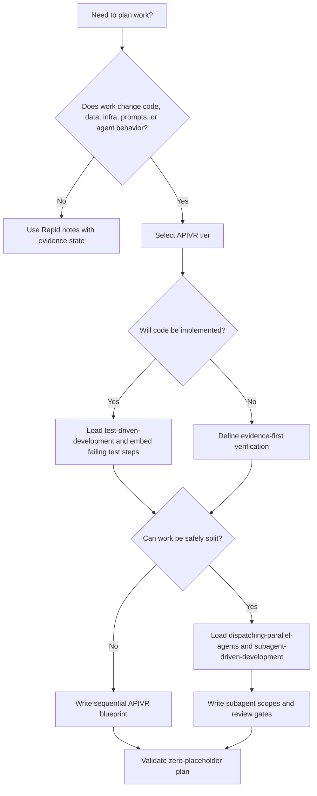

# Writing Plans

Use this skill during APIVR Phase 2. A plan is acceptable only when a competent agent can execute it without inventing missing decisions.

<HARD-GATE>
Do not produce a vague plan. Do not use placeholders such as TBD, later, as needed, fix tests, update files, or handle edge cases. If information is unknown, name the exact discovery step that will make it known.
</HARD-GATE>

## Required Inputs

- APIVR tier and applicable Elite Build Goals.
- Objective, non-goals, acceptance criteria, and affected users/systems.
- Exact files, commands, APIs, routes, schemas, assets, providers, jobs, or deployment surfaces in scope.
- Evidence required for each material claim.
- Rollback or restoration path for Standard and above.

## Plan Structure

1. State APIVR tier and why that tier is sufficient.
2. List applicable Elite Build Goals and their effect on the plan.
3. Summarize current state from observed files or systems.
4. Define in scope, out of scope, preserved behavior, and smallest safe change.
5. Write concrete implementation steps with exact file paths.
6. For code work, embed the failing test or test-case skeleton before production-code steps.
7. Add verification commands, manual checks, evidence states, and expected results.
8. Add rollback triggers and restoration steps.
9. Add challenge-review questions for Important, Critical, Comprehensive, or Forensic work.

## Decision Flow



## Embedded Test Requirement

For implementation plans, include this section before production changes:

```text
Failing test first:
- File:
- Test name:
- Behavior being proved:
- Expected failing result before implementation:
- Command to run:
- Evidence state after red phase:
```

If the work is not testable with an automated test, write an evidence-first substitute and explain why automation is not the smallest safe route.

## Good / Bad

<Bad>
Update the API handler and add tests.
</Bad>

<Good>
1. Add failing test in `tests/billing/renewal.test.ts` named `renews annual plan without duplicate invoice`.
2. Run `npm test -- tests/billing/renewal.test.ts`; expected result: fails because duplicate invoice guard is missing.
3. Update `src/billing/renewal.ts` to check existing invoice by customer, plan, and billing period before creating a new one.
4. Re-run the same test; expected result: pass.
5. Run `npm test -- tests/billing/renewal.test.ts tests/billing/webhook.test.ts`; expected result: pass.
</Good>

## Worked Example

Scenario: Add webhook retry protection for a payment provider.

- APIVR tier: Comprehensive because money, external API, and duplicate writes are involved.
- Skills loaded: `external-api-integration`, `test-driven-development`, `subagent-driven-development` if delegated.
- Plan writes a failing test proving duplicate webhook delivery creates one payment record.
- Implementation step updates the webhook handler idempotency key.
- Verification includes test pass, safe replay check, log redaction check, and release gate review.
- APIVR verdict can be `PASS` only when duplicate prevention, secret handling, and replay evidence are Verified.

## Completion Standard

A plan is complete when every action has an owner or executing agent, exact target, expected evidence state, and stop condition. Mark the plan `BLOCKED` instead of filling gaps with assumptions.
